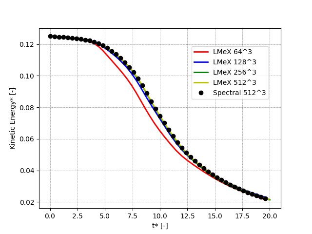

PeleLMeX validations
====================

This section is work-in-progress.

Taylor-Green vortex breakdown
~~~~~~~~~~~~~~~~~~~~~~~~~~~~~

The Taylor-Green vortex breakdown case is a classical CFD test case
described in `here <>`

Building and running
####################

.. code-block:: bash

   $ make -j 16 DIM=3 USE_MPI=TRUE TPL
   $ make -j 16 DIM=3 USE_MPI=TRUE
   $ mpiexec -n 16 $EXECUTABLE inputs_3d amr.ncell=64 64 64

The user can run a convergence study by varying ``amr.ncell``.

Results
#######

The following figures shows the kinetic energy, the dissipation rate and 
the enstrophy as function of time (all quantities are non-dimensional)
for increasing resolutions (ranging from 64^3 to 512^3) and compared
to the results of a high-order spectral solver with a 512^3 resolution.

.. figure:: images/validations/TaylorGreen/Dissipation.png
   :align: center
   :figwidth: 60%

.. figure:: images/validations/TaylorGreen/Enstrophy.png
   :align: center
   :figwidth: 60%
