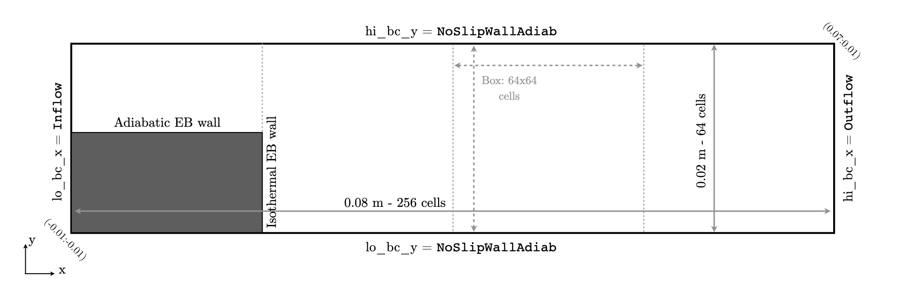
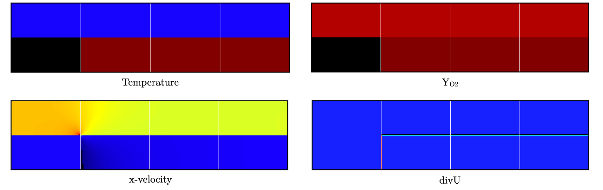
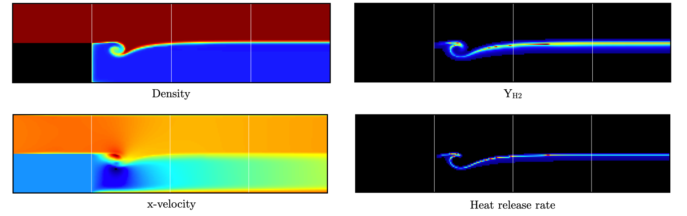

.. highlight:: rst

.. _sec:tutorialBFS:

Backward facing step anchored premixed flame
============================================

.. _sec:TUTO_BFS::Intro:

Introduction
------------

`PeleLMeX` primary objective is to enable simulations of reactive flows on platforms ranging
from small personal computer to Exascale supercomputer. This tutorial describes the case
of a 2D laminar premixed methane/air flame anchored behind a backward facing step.

The goal of this tutorial is to introduce `PeleLMeX` users to more advanced reactive simulations setup as
well as embedded boundaries.

..  _sec:TUTO_BFS::PrepStep:

Setting-up your environment
---------------------------

Getting a functioning environment in which to compile and run `PeleLMeX` is the first step of this tutorial.
Follow the steps listed below to get to this point:

#. The first step consist in getting `PeleLMeX` and its dependencies. To do so, use a recursive *git clone*: ::

    git clone --recursive https://github.com/AMReX-Combustion/PeleLMeX.git

#. Move into the Exec folder containing the ``FlameSheet``. To do so: ::

    cd PeleLMeX/Exec/RegTests/FlameSheet

Note that the makefile system is set up such that default paths are automatically set to the
submodules obtained with the recursive *git clone*, however the user can set its own dependencies
in the `GNUmakefile` by updating the top-most lines as follows: ::

       PELELMEX_HOME     = <path_to_PeleLMeX>
       AMREX_HOME        = <path_to_MyAMReX>
       AMREX_HYDRO_HOME  = <path_to_MyAMReXHydro>
       PELE_PHYSICS_HOME = <path_to_MyPelePhysics>

or directly through shell environement variables (using *bash* for instance): ::

       export PELELMEX_HOME=<path_to_PeleLMeX>
       export AMREX_HOME=<path_to_MyAMReX>
       export AMREX_HYDRO_HOME=<path_to_MyAMReXHydro>
       export PELE_PHYSICS_HOME=<path_to_MyPelePhysics>

You're good to go !

Case setup
----------

A `PeleLMeX` case folder generally contains a minimal set of files to enable compilation,
and the reader is referred to the FlameSheet tutorial :doc:`Tutorials_FlameSheet` for a
more detailed description of `PeleLMeX` case setup. The case of interest for this 
tutorial can be found in `PeleLMeX` Exec folder: ::

    Exec/RegTests/EB_BackwardStepFlame

Geometry, grid and boundary conditions
^^^^^^^^^^^^^^^^^^^^^^^^^^^^^^^^^^^^^^

This simulation is performed on a 0.08x0.02 :math:`m^2` 2D computational domain,
with the bottom left corner located at (-0.01:-0.01) and the top right corner at (0.07:0.01). The flow
is primarily aligned with the :math:`x` direction with an ``Inflow`` (dirichlet) boundary on the :math:`x`-low 
and ``Outflow`` (0-neumann) boundary on :math:`x`-high. No-slip wall condition are imposed the transverse direction.
Finally a Cartesian coordinate system is used here. A overview of the computational domain is provided in :numref:`BFS_SetupGeom`.

   : Setup of the computational domain for the backward facing step flame case.

All of the geometrical information can be specified the first two blocks of the input file (`input.2d`): ::

   #---------------------- DOMAIN DEFINITION ------------------------
   geometry.is_periodic = 0 0                  # For each dir, 0: non-perio, 1: periodic
   geometry.coord_sys   = 0                    # 0 => cart, 1 => RZ
   geometry.prob_lo     = -0.01   -0.01        # x_lo y_lo (z_lo)
   geometry.prob_hi     =  0.07    0.01        # x_hi y_hi (z_hi)

   #---------------------- BC FLAGS ---------------------------------
   # Interior, Inflow, Outflow, Symmetry,
   # SlipWallAdiab, NoSlipWallAdiab, SlipWallIsotherm, NoSlipWallIsotherm
   peleLM.lo_bc = Inflow  NoSlipWallAdiab      # bc in x_lo y_lo (z_lo)
   peleLM.hi_bc = Outflow NoSlipWallAdiab      # bc in x_hi y_hi (z_hi)

.. note::
    Note that when running 2D simulations, it is not necessary to specify entries for the third dimension.

The base grid is decomposed into a 256x64 cells array with AMR initially not activated.

The refinement ratio between each level is set to 2 and `PeleLMeX` currently does not support
refinement ratio of 4. Regrid operation will be performed every 5 steps. ``amr.n_error_buf`` specifies,
for each level, the number of buffer cells used around the cell tagged for refinement, while ``amr.grid_eff``
describes the grid efficiency, i.e. how much of the new grid contains tagged cells. Higher values lead
to tighter grids around the tagged cells.

All of those parameters are specified in the `AMR CONTROL` block: ::

   #------------------------- AMR CONTROL ----------------------------
   amr.n_cell          = 256 64           # Level 0 number of cells in each direction
   amr.max_level       = 0                # maximum level number allowed
   amr.ref_ratio       = 2 2 2 2          # refinement ratio
   amr.regrid_int      = 5                # how often to regrid
   amr.n_error_buf     = 2 2 2 2          # number of buffer cells in error est
   amr.grid_eff        = 0.7              # what constitutes an efficient grid
   amr.blocking_factor = 16               # block factor in grid generation
   amr.max_grid_size   = 64               # maximum box size

Finally, this case use Embedded Boundaries to represent the backward facing step. The EB is 
defined as a box on the lower-left corner of the domain. For such an easy geometry, 
AMReX native simple CGS are sufficient. The box will extend from a point beyond
the computational domain bottom left corner to (0.01:0.0). Because the intersection of the
EB with the computational grid can lead to arbitrarily small cells, AMReX provides 
``eb2.small_volfrac`` to set a cell volume fraction limit below which a cell
is considered fully covered. In the present simulation, we will treat the EB
as an isothermal boundary, with control over the wall temperature described in the
next section.

::

   #---------------------- EB SETUP ---------------------------------
   eb2.geom_type = box
   eb2.box_lo =    -0.02   -0.02
   eb2.box_hi =     0.01     0.0
   eb2.box_has_fluid_inside = 0
   eb2.small_volfrac   = 1.0e-4
   peleLM.isothermal_EB = 1

.. note::
    When EBs intersect with the domain boundary, it is important to ensure that
    the EB definition extend slightly beyond the domain boundaries to provide
    EB structure data in the domain ghost cells.

Problem specifications
^^^^^^^^^^^^^^^^^^^^^^

..  _sec:TUTO_BFS::Problem:

The problem setup is mostly contained in the three C++ source/header files described in :doc:`Tutorials_FlameSheet`.
The user parameters are gathered in the struct defined in  ``pelelm_prob_parm.H``: ::

    struct ProbParm
    {
        amrex::Real T_mean = 298.0_rt;
        amrex::Real P_mean = 101325.0_rt;
        amrex::Real Y_fuel = 0.0445_rt;
        amrex::Real Y_o2   = 0.223_rt;
        amrex::Real T_hot  = 1800.0_rt;
        amrex::Real Twall  = 300.0_rt;
        amrex::Real meanFlowMag = 0.0;
    };

* ``T_mean`` : inlet and initial gas temperature

* ``P_mean`` : initial thermodynamic pressure

* ``Y_fuel`` : inlet and initial fuel (CH4) mass fraction

* ``Y_oxid`` : inlet and initial oxidizer (O2) mass fraction

* ``T_hot`` : initial temperature in the step wake

* ``T_wall`` : EB-wall temperature

* ``meanFlowMag`` : inlet :math:`x` velocity

The initial solution consist of a premixed methane/air mixture in the upper part of the domain
and pure hot air in the wake of the step. The default parameters provided above are overwritten
using AMReX ParmParse in ``pelelm_prob.cpp`` and the initial/boundary conditions implemented in
``pelelm_prob.H``.

In addition to these three C++ files, an extra header is needed in the present case compared to
:doc:`Tutorials_FlameSheet` : ``EBUserDefined.H``. This file is necessary to specify more complex EB
geometries (not the case here) and to prescribe EB isothermal wall condition. It contains three functions:

* ``EBUserDefined()`` : can be used to provide a user-defined geometry. It is left empty in the present case.

* ``setEBState()`` : takes in the EB face center coordinates and return a vector for the entire state vector. For
  isothermal walls, only the ``TEMP`` component is required.

* ``setEBType()`` : even though ``peleLM.isothermal_EB=1`` is activated, the user can locally decide to use
  an adiabatic wall on part of the EB. To do so, this function takes in the EB face center coordinates
  and return a ``Real`` flag that should be set to 1.0 on isothermal areas and 0.0 on adiabatic areas. The
  flag is later used to pre-multiply the thermal diffusivity effectively zeroing the thermal flux where the flag 
  is 0.0.

In the present case, we set the EB temperature to ``T_wall`` everywhere on the EB in ``setEBState()`` but 
the EB flag is only set to 1.0 on the vertical EB faces (:math:`x` normal) such that the top of the EB box
is adiabatic.

Numerical parameters
^^^^^^^^^^^^^^^^^^^^

The ``PeleLM CONTROL`` block contains a few of the `PeleLMeX` algorithmic parameters. Many more
unspecified parameters are relying on their default values which can be found in :doc:`LMeXControls`.
Of particular interest are the ``peleLM.sdc_iterMax`` parameter controlling the number of
SDC iterations (see :doc:`Model` for more details on SDC in `PeleLMeX`) and the
``peleLM.num_init_iter`` one controlling the number of initial iteration the solver will do
after initialization to obtain a consistent pressure and velocity field.

Building the executable
-----------------------

Now that we have reviewed the basic ingredients required to setup the case, it is time to build the `PeleLMeX` executable.
Although both GNUmake and CMake are available, it is advised to use GNUmake. The ``GNUmakefile`` file provides some compile-time options
regarding the simulation we want to perform.
The first few lines specify the paths towards the source codes of `PeleLMeX`, `AMReX`, `AMReX-Hydro` and `PelePhysics`, overwritting
any environment variable if necessary, and might have been already updated in :ref:`sec:TUTO_BFS::PrepStep` earlier.

The next few lines specify AMReX compilation options and compiler selection: ::

   # AMREX
   DIM             = 2
   DEBUG           = FALSE
   PRECISION       = DOUBLE
   VERBOSE         = FALSE
   TINY_PROFILE    = FALSE
   USE_EB          = TRUE
   USE_HYPRE       = FALSE

   # Compilation
   COMP            = gnu
   USE_MPI         = TRUE
   USE_OMP         = FALSE
   USE_CUDA        = FALSE
   USE_HIP         = FALSE

It allows users to specify the number of spatial dimensions (2D), activate the compilation of the EB aware AMReX source code,
trigger debug compilation and other AMReX options. The compiler (``gnu``) and the parallelism paradigm 
(in the present case only MPI is used) are then selected. Note that on OSX platform, one should update the compiler to ``llvm``.

The user also need to make sure the additional C++ header employed define the EB state is included in the build: ::

   # PeleLMeX
   CEXE_headers    += EBUserDefined.H

In `PeleLMeX`, the chemistry model (set of species, their thermodynamic and transport properties as well as the description
of their of chemical interactions) is specified at compile time. Chemistry models available in 
`PelePhysics` can used in `PeleLMeX` by specifying the name of the folder in `PelePhysics/Support/Mechanisms/Models` containing 
the relevant files, for example: ::

   Chemistry_Model = drm19

Here, the model ``drm19``, contains 21 species and describe the chemical decomposition of methane.
The user is referred to the `PelePhysics <https://pelephysics.readthedocs.io/en/latest/>`_ documentation for a
list of available mechanisms and more information regarding the EOS, chemistry and transport models specified: ::

    Eos_Model       := Fuego
    Transport_Model := Simple

Note that the ``Chemistry_Model`` must be similar to the one used to generate the Cantera solution.

Finally, `PeleLMeX` utilizes the chemical kinetic ODE integrator `CVODE <https://computing.llnl.gov/projects/sundials/cvode>`_. This Third Party Librabry (TPL) is not shipped with the `PeleLMeX` distribution but can be readily installed through the makefile system of `PeleLMeX`. Note that compiling Sundials is necessary even if the simualtion do not involve reactions. To do so, type in the following command: ::

    make -j4 TPL

Note that the installation of `CVODE` requires CMake 3.17.1 or higher.

You are now ready to build your first `PeleLMeX` executable !! Type in: ::

    make -j4

The option here tells `make` to use up to 4 processors to create the executable (internally, `make` follows a dependency graph to ensure any required ordering in the build is satisfied). This step should generate the following file (providing that the build configuration you used matches the one above): ::

    PeleLMeX2d.gnu.MPI.ex

You're good to go!

Checking the initial conditions
-------------------------------

It is always a good practice to check the initial conditions. To do so, run the simulation specifying
an ``amr.max_step`` of 0. Open the ``input.2d`` with your favorite editor and update the following parameters ::

    #---------------------- Time Stepping CONTROL --------------------
    amr.max_step      = 0             # Maximum number of time steps

Since we've set the maximum number of steps to 0, the solver will exit after
the initial solution is obtained. Let's run the simulation with the default problem parameter
listed in the input file. To do so, use: ::

    ./PeleLMeX2d.gnu.MPI.ex input.2d-regt

A number of information are printed to the screen:

#. AMReX/SUNDIALs initialization along with the git hashes of the various subrepositories

#. A summary of the `PeleLMeX` state components

#. Initial projection and initial iterations.

#. Saving the initial solution to `plt00000` file.

Use Amrvis, Paraview or yt to visualize the plot file. Using Amrvis, the solution should look
similar to :numref:`BFS_InitSol`.

   : Contour plots of temperature, O2 mass fraction, :math:`x`-velocity component and divergence constraint after initialization.

Note that in `PeleLMeX`, EB-covered region are set to zero in plotfiles. Hot gases are found in the wake
of the EB as expected, with a slightly higher O2 mass fraction compared to the upper part of the domain
where CH4 is present in the mixture. The velocity field results from the initial projection, which uses 
the divergence constraint. The later is negative close to the isothermal EB because the cold EB leads
to an increase of density. `divU` is also non zero at the interface between the incoming fresh gases and 
the hot ait due to heat diffusion.

Advance the solution on coarse grid
-----------------------------------

Let's now advance the solution for 250 steps, using only the base grid and the default time stepping
parameters. To do so, ensure that: ::

    amr.max_step = 250

Additionally, make sure that ``amr.check_int`` is set to a positive value to trigger writing a
checkpoint file from which to later restart the simulation. If available, use more than one MPI
rank to run the simulation and redirect the standard output to a log file using: ::

    mpirun -n 4 ./PeleLMeX2d.gnu.MPI.ex input.2d > logInitCoarse.dat &

Using 4 MPI ranks, it takes about 200 seconds to complete.
A typical `PeleLMeX` stdout for a time step now looks like: ::

    ====================   NEW TIME STEP   ====================
    Est. time step - Conv: 9.42747435e-06, divu: 0.0002752479251
    STEP [125] - Time: 5.072407773e-05, dt 5.072441746e-06
      SDC iter [1]
      SDC iter [2]
    >> PeleLM::Advance() --> Time: 0.877052

clearly showing the use of 2 SDC iterations. The first line at each step provide
the time step contraint from the CFL
condition (``Conv:``) and from the density change condition (``divu:``).
Since an initial ``dt_shrink`` was applied upon initialization, the
current step is smaller than the CFL but progressively increases
over the course of the simulation, eventually reaching the CFL constrained
step size after 133 steps. After 250 steps, the simulation time is around 1.25 ms and
the step size is of the order of 10 :math:`\mu s`.

Visualizing the `plt00250` file, we can see that the solution has eveolved, with a
vortex propagating downstream along the flame surface, while intermediate species
can be found. Looking at the heat release rate and the H2 mass fraction, we can see that
the flame front is very poorly resolved.

   : Contour plots of density, H2 mass fraction, :math:`x`-velocity component and heat release rate after 250 steps.
