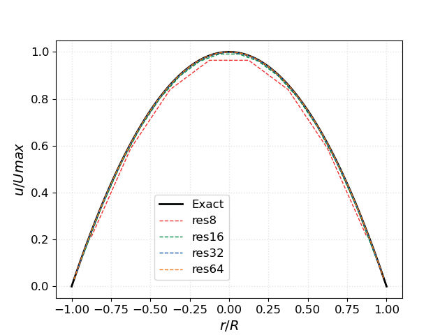
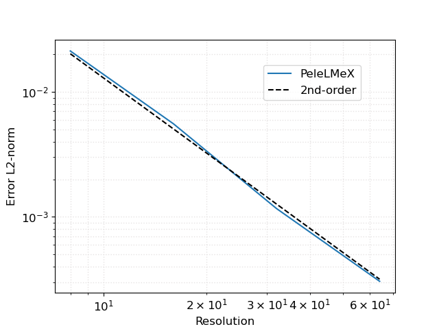
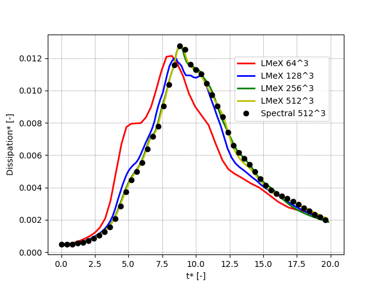
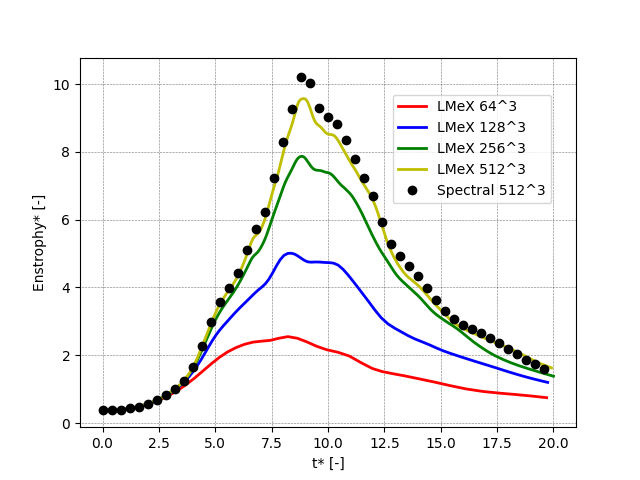
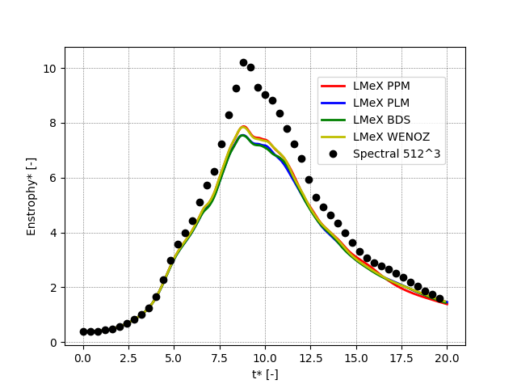

PeleLMeX Verification & Validations
===================================

This section is work-in-progress.

Laminar Poiseuille flow
~~~~~~~~~~~~~~~~~~~~~~~

The laminar pipe flow or Poiseuille flow, is a basic test case for wall bounded flows.
In the present configuration, the geometry consist of a circular channel of radius :math:`R` = 1 cm
aligned with the :math:`x`-direction, where no-slip boundary conditions are imposed on
EB surface. The flow is periodic in the :math:`x`-direction and a background pressure
gradient :math:`dp /dx` is used to drive the flow.

The exact solution at steady state is:

.. math::
   u(r) = \frac{G}{4 \mu} (R^2 - r^2)

where :math:`G = -dp/dx`, and :math:`\mu` is the dynamic viscosity.
The test case can be found in ``Exec/RegTests/EB_PipeFlow``, where
the input parameters are very similar to the PeleC counterpart of
this case.

The steady-state :math:`x`-velocity profiles accross the pipe diameter
at increasing resolution are plotted along with the theorerical profile:

A more quantitative evaluation of PeleLMeX results is obtained by calculating
the L2 norm of the error against the analytical profile:

showing second-order convergence for this diffusion dominated flow.

Taylor-Green vortex breakdown
~~~~~~~~~~~~~~~~~~~~~~~~~~~~~

The Taylor-Green vortex breakdown case is a classical CFD test case
described in `here <https://www1.grc.nasa.gov/research-and-engineering/hiocfd/>`_
(case C3.3). It is intended to test the capability of the code to capture turbulence accurately,
with the flow transitioning to turbulence, with the creation of small scales, followed
by a decay phase similar to decaying homogeneous turbulence.

Building and running
####################

The test case can be found in ``Exec/RegTests/TaylorGreen``.

.. code-block:: bash

   $ make -j 16 DIM=3 USE_MPI=TRUE TPL
   $ make -j 16 DIM=3 USE_MPI=TRUE
   $ mpiexec -n 16 $EXECUTABLE inputs_3d amr.ncell=64 64 64

The user can run a convergence study by varying ``amr.ncell``.

Results
#######

The following figures shows the kinetic energy, the dissipation rate and
the enstrophy as function of time (all quantities are non-dimensional)
for increasing resolutions (ranging from 64^3 to 512^3) and compared
to the results of a high-order spectral solver with a 512^3 resolution.
`PeleLMeX` results are obtained with the *Godunov_PPM* scheme and show
that even though `PeleLMeX` uses a 2nd-order scheme, reasonable
accuracy compared to the spectral results is obtained when the resolution is sufficient.

.. figure:: images/validations/TaylorGreen/KinEnergy.png
   :align: center
   :figwidth: 60%

Additionnally, it is interesting to compare the different advection schemes
available in `PeleLMeX` (namely, *Godunov_PLM*, *Godunov_PPM*, *Godunov_BDS*,
*Godunov_PPM_WENOZ*) at a fixed 256^3 spatial resolution:

On this particular case, the differences between the advection schemes are fairly
marginal compared to those observed at different grid resolutions.
