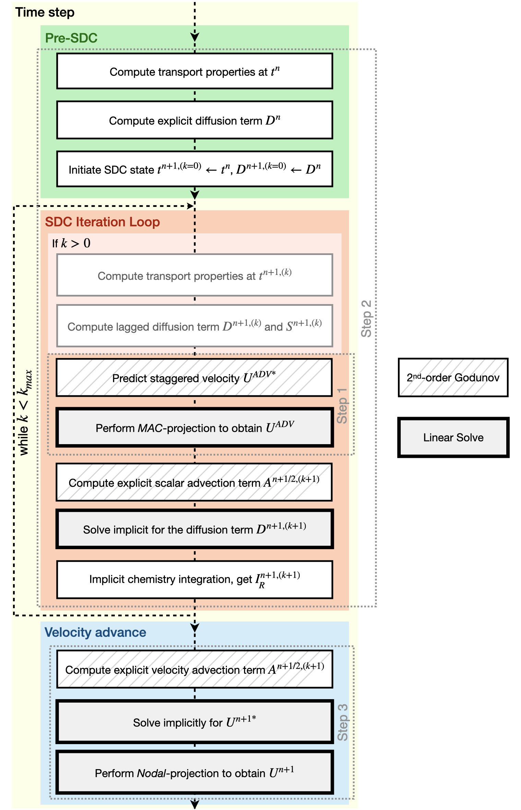
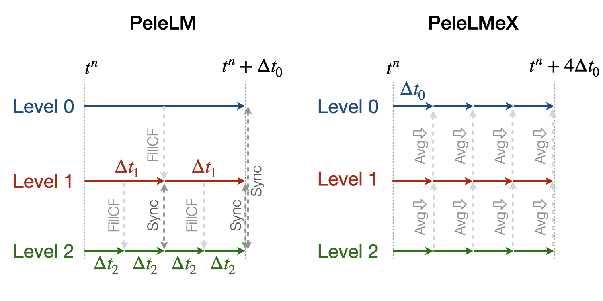

.. highlight:: rst

.. _sec:model:

The `PeleLMeX` Model
====================

In this section, we present the actual model that is evolved numerically by `PeleLMeX`, and the numerical algorithms
to do it.  There are many control parameters to customize the solution strategy and process, and in order to actually
set up and run specific problems with `PeleLMeX`, the user must specific the chemical model, and provide routines
that implement initial and boundary data and refinement criteria for the adaptive mesh refinement.  We discuss
setup and control of `PeleLMeX` in later sections.

Overview of `PeleLMeX`
----------------------

`PeleLMeX` is the non-subcycling version of `PeleLM <https://amrex-combustion.github.io/PeleLM/>`_ a parallel,
adaptive mesh refinement (AMR) code that solves the reacting Navier-Stokes equations in the low Mach number regime.

In a nutshell, `PeleLMeX` features include:

* Software :
   * Written in C++
   * Parallelization using MPI+X approach, with X one of OpenMP, CUDA, HIP or SYCL
   * Parallel I/O
   * Built-in profiling tools
   * Plotfile format supported by `Amrvis <https://github.com/AMReX-Codes/Amrvis/>`_, `yt <http://yt-project.org/>`_, `Paraview <https://www.paraview.org/>`_
* Physics & numerics :
   * Finite volume, block-structured AMR approach
   * 2D-Cartesian, 2D-Axisymmetric and 3D support
   * Combustion (transport, kinetics, thermodynamics) models based on Cantera and EGLib through `PelePhysics <https://github.com/AMReX-Combustion/PelePhysics>`_
   * Complex geometries using Embedded Boundaries (EB)
   * Second-order projection methodology for enforcing the low Mach number constraint
   * Time advance based on a spectral-deferred corrections approach that conserves species mass and energy and evolves on the equation of state
   * Several higher-order Godunov integration schemes for advection
   * Temporally implicit viscosity, species mass diffusion, thermal conductivity, chemical kinetics
   * Closed chamber algorithm enable time-varying background pressure changes
   * Lagrangian spray description and Hybrid Method of Moments Soot modeling using `PelePhysics <https://github.com/AMReX-Combustion/PelePhysics>`_ (formerly these were part of `PeleMP <https://github.com/AMReX-Combustion/PeleMP>`_).

Mathematical background
-----------------------

`PeleLMeX` evolves chemically reacting low Mach number flows with block-structured adaptive mesh refinement (AMR). The code depends upon the `AMReX <https://github.com/AMReX-Codes/amrex>`_ library to provide the underlying data structures, and tools to manage and operate on them across massively parallel computing architectures. `PeleLMeX` also utilizes the source code and algorithmic infrastructure of `AMReX-Hydro <https://github.com/AMReX-Fluids/AMReX-Hydro>`_. `PeleLMeX` borrows heavily from `PeleLM`_. The core algorithms in `PeleLM` are described in the following papers:

* *A conservative, thermodynamically consistent numerical approach for low Mach number combustion. I. Single-level integration*, A. Nonaka, J. B. Bell, and M. S. Day, *Combust. Theor. Model.*, **22** (1) 156-184 (2018)

* *A Deferred Correction Coupling Strategy for Low Mach Number Flow with Complex Chemistry*, A. Nonaka, J. B. Bell, M. S. Day, C. Gilet, A. S. Almgren, and M. L. Minion, *Combust. Theory and Model*, **16** (6) 1053-1088 (2012)

* *Numerical Simulation of Laminar Reacting Flows with Complex Chemistry*, M. S. Day and J. B. Bell, *Combust. Theory Model* **4** (4) 535-556 (2000)

* *An Adaptive Projection Method for Unsteady, Low-Mach Number Combustion*, R. B. Pember, L. H. Howell, J. B. Bell, P. Colella, W. Y. Crutchfield, W. A. Fiveland, and J. P. Jessee, *Comb. Sci. Tech.*, **140** 123-168 (1998)

* *A Conservative Adaptive Projection Method for the Variable Density Incompressible Navier-Stokes Equations,* A. S. Almgren, J. B. Bell, P. Colella, L. H. Howell, and M. L. Welcome, *J. Comp. Phys.*, **142** 1-46 (1998)

The low Mach number flow equations
^^^^^^^^^^^^^^^^^^^^^^^^^^^^^^^^^^

`PeleLMeX` solves the reacting Navier-Stokes flow equations in the *low Mach number* regime, where the characteristic fluid velocity is small compared to the sound speed, and the effect of acoustic wave propagation is unimportant to the overall dynamics of the system. Accordingly, acoustic wave propagation can be mathematically removed from the equations of motion, allowing for a numerical time step based on an advective CFL condition, and this leads to an increase in the allowable time step of order :math:`1/M` over an explicit, fully compressible method (:math:`M` is the Mach number).  In this mathematical framework, the total pressure is decomposed into the sum of a spatially constant (ambient) thermodynamic pressure :math:`p_0` and a perturbational pressure, :math:`\pi({\vec x})` that drives the flow.  Under suitable conditions, :math:`\pi/p_0 = \mathcal{O} (M^2)`. Note that :math:`p_0` is spatially constant, but can be time-dependent as described in the next section.

The set of conservation equations specialized to the low Mach number regime is a system of PDEs with advection, diffusion and reaction (ADR) processes that are constrained to evolve on the manifold of a spatially constant :math:`p_0`:

.. math::

    &\frac{\partial (\rho \boldsymbol{u})}{\partial t} +
    \nabla \cdot \left(\rho  \boldsymbol{u} \boldsymbol{u} + \tau \right)
    = -\nabla \pi + \rho \boldsymbol{F},\\
    &\frac{\partial (\rho Y_m)}{\partial t} +
    \nabla \cdot \left( \rho Y_m \boldsymbol{u}
    + \boldsymbol{\mathcal{F}}_{m} \right)
    = \rho \dot{\omega}_m,\\
    &\frac{ \partial (\rho h)}{ \partial t} +
    \nabla \cdot \left( \rho h \boldsymbol{u}
    + \boldsymbol{\mathcal{Q}} \right) = 0 ,

where :math:`\rho` is the density, :math:`\boldsymbol{u}` is the velocity, :math:`h` is the mass-weighted enthalpy, :math:`T` is temperature and :math:`Y_m` is the mass fraction of species :math:`m`. :math:`\dot{\omega}_m` is the molar production rate for species :math:`m`, the modeling of which will be described later in this section. :math:`\tau` is the stress tensor, :math:`\boldsymbol{\mathcal{Q}}` is the heat flux and :math:`\boldsymbol{\mathcal{F}}_m` are the species diffusion fluxes. These transport fluxes require the evaluation of transport coefficients (e.g., the viscosity :math:`\mu`, the conductivity :math:`\lambda` and the diffusivity matrix :math:`D`) which are computed using the library EGLIB, as will be described in more depth in the diffusion section. The momentum source, :math:`\boldsymbol{F}`, is an external forcing term.  For example, we have used :math:`\boldsymbol{F}` to implement a long-wavelength time-dependent force to establish and maintain quasi-stationary turbulence.

These evolution equations are supplemented by an equation of state for the thermodynamic pressure.  For example, the ideal gas law,

.. math::

    p_0(\rho,Y_m,T)=\frac{\rho \mathcal{R} T}{W}=\rho \mathcal{R} T
    \sum_m \frac{Y_m}{W_m} .

In the above, :math:`W_m` and :math:`W` are the species :math:`m`, and mean molecular weights, respectively.  To close the system we also require a relationship between enthalpy, species and temperature.  We adopt the definition used in the CHEMKIN standard,

.. math::

    h=\sum_m Y_m h_m(T)

where :math:`h_m` is the species :math:`m` enthalpy.  Note that expressions for :math:`h_m(T)` see <section on thermo properties> incorporate the heat of formation for each species.

Neither species diffusion nor reactions redistribute the total mass, hence we have :math:`\sum_m \boldsymbol{\mathcal{F}}_m = 0` and :math:`\sum_m \dot{\omega}_m = 0`. Thus, summing the species equations and using the definition :math:`\sum_m Y_m = 1` we obtain the continuity equation:

.. math::

    \frac{\partial \rho}{\partial t} + \nabla \cdot \rho \boldsymbol{u} = 0

This, together with the conservation equations form a differential-algebraic equation (DAE) system that describes an evolution subject to a constraint.  A standard approach to attacking such a system computationally is to differentiate the constraint until it can be recast as an initial value problem.  Following this procedure, we set the thermodynamic pressure constant in the frame of the fluid,

.. math::

    \frac{Dp_0}{Dt} = 0

and observe that if the initial conditions satisfy the constraint, an evolution satisfying the above will continue to satisfy the constraint over all time.  Expanding this expression via the chain rule and continuity:

.. math::

    \nabla \cdot \boldsymbol{u} = \frac{1}{T}\frac{DT}{Dt}
    + W \sum_m \frac{1}{W_m} \frac{DY_m}{Dt} = S

The constraint here take the form of a condition on the divergence of the flow.  Note that the actual expressions to use here will depend upon the chosen models for evaluating the transport fluxes.

For the standard ideal gas EOS, the divergence constraint on velocity becomes:

.. math::

    \nabla \cdot \boldsymbol{u} &= \frac{1}{\rho c_p T} \left(\nabla \cdot \lambda\nabla T - \sum_m \boldsymbol{\Gamma_m} \cdot \nabla h_m \right) \\
    &- \frac{1}{\rho} \sum_m \frac{W}{W_m} \nabla \cdot \boldsymbol{\Gamma_m} + \frac{1}{\rho}\sum_m \left(\frac{W}{W_m} - \frac{h_m}{c_p T} \right) \dot \omega \equiv S .

Confined domain ambient pressure
^^^^^^^^^^^^^^^^^^^^^^^^^^^^^^^^

In unconfined domains, the ambient pressure will remain constant in time, but for confined domains, this is not the case. Above, we assumed that :math:`p_0` was constant. If :math:`p_0` is a function of time, the pressure derivative term must be restored in the velocity divergence constraint as:

.. math::

    \nabla \cdot \boldsymbol{u} + \theta \frac{dp_0}{dt} = S ,

where :math:`\theta \equiv 1/(\Gamma_1 p_0)`, with :math:`\Gamma_1 = \partial ln(p)/\partial ln(\rho)|_s` being the first adiabatic exponent. :math:`\Gamma_1` depends on the composition and is not a constant. Both :math:`\theta` and :math:`\S` can be decomposed into mean and fluctuating components and the above equation can be rewritten as:

.. math::

    \nabla \cdot \boldsymbol{u} + (\overline \theta + \delta \theta)\frac{dp_0}{dt} = \overline S + \delta S,

where :math:`\overline \theta` and :math:`\overline S` are the mean values of :math:`\theta` and :math:`S` over the domain, and :math:`\delta \theta` and :math:`\delta S` are the perturbations off their respective means that both integrate to zero over the domain, by definition. This equation can be simplified by integrating over the domain volume:

.. math::

    \int_V \nabla \cdot \boldsymbol{u} dV + \int_V (\overline \theta + \delta \theta)\frac{dp_0}{dt} dV = \int_V (\overline S + \delta S) dV

Since the perturbations integrate to zero over the domain volume, the mean values are constants, and :math:`p_0` is only a function of time, the above simplifies to:

.. math::

    \frac{1}{V} \int_V \nabla \cdot \boldsymbol{u} dV + \overline \theta \frac{dp_0}{dt} = \overline S .

Solving for :math:`dp_0/dt` yields an evolution equation of :math:`p_0`:

.. math::

    \frac{dp_0}{dt} = \frac{1}{\overline \theta} \left(\overline S - \frac{1}{V} \int_A \boldsymbol{u} dA \right) ,

where we have used the divergence theorem to convert the volume integral into a surface integral over the domain boundaries: :math:`\int_V \nabla \cdot \boldsymbol{u} dV = \int_A \boldsymbol{u} dA`. The above pressure evolution is accompanied by a modified velocity constraint:

.. math::

    \nabla \cdot \boldsymbol{u} = \delta S - \delta \theta \frac{\overline S}{\overline \theta} - \left(1 + \frac{\theta}{\overline \theta} \right) \frac{1}{V} \int_A \boldsymbol{u} dA

The above equations hold for any fully enclosed or partially enclosed domain where there can be mass flowing into or out of the domain, but the next flowrate is non-zero and therefore the pressure should be adjusted in time. In a perfectly enclosed domain, where there is no mass in or out of the system, :math:`\int_A \boldsymbol{u} dA = 0` and the pressure evolution is simplified to:

.. math::

    \frac{dp_0}{dt} = \frac{\overline S}{\overline \theta} ,

and simplified velocity constraint,

.. math::

     \nabla \cdot \boldsymbol{u} = \delta S - \delta \theta \frac{\overline S}{\overline \theta} .

PeleLMeX Algorithm
------------------

An overview of `PeleLMeX` time-advance function is provided in :numref:`LMeX_Algo` and details are provided in the following subsections.

   : Flowchart of the *PeleLMeX* advance function.

The three steps of the low Mach number projection scheme described :ref:`below <ssec:projScheme>` are referenced to better
emphasize how the thermodynamic solve is closely weaved into the fractional step approach. Striped boxes indicate where the
:ref:`Godunov procedure <ssec:advScheme>` is employed while the four different linear solves are highlighted.

Low Mach number projection scheme
^^^^^^^^^^^^^^^^^^^^^^^^^^^^^^^^^
.. _ssec:projScheme:

`PeleLMeX` implements a finite-volume, Cartesian grid discretization approach with constant grid spacing, where
:math:`U`, :math:`\rho`, :math:`\rho Y_m`, :math:`\rho h`, and :math:`T` represent cell averages, and the pressure field, :math:`\pi`, is defined on the nodes
of the grid, and is temporally constant on the intervals over the time step.
The projection scheme is based on a fractional step approach where, for purely incompressible flow, the velocity is first advanced in time
using the momentum equation (**Step 1**) and subsequently projected to enforce the divergence constraint (**Step 3**). When considering variable density flows,
the scalar thermodynamic advance is performed between these two steps (**Step 2**), but within the SDC context, **Step 1** and **Step 2** are effectively interlaced.
The three major steps of the algorithm (Almgren *et al.* 1998, Day and Bell, 2000, Nonaka *et al.* 2012):

**Step 1**: (*Compute advection velocities*) Use a second-order Godunov procedure to predict a time-centered
velocity, :math:`U^{{\rm ADV},*}`, on cell faces using the cell-centered data (plus sources due to any auxiliary forcing) at :math:`t^n`,
and the lagged pressure gradient from the previous time interval, which we denote as :math:`\nabla \pi^{n-1/2}`.
This provisional field, :math:`U^{{\rm ADV},*}`, fails to satisfy the divergence constraint. We apply a discrete projection (termed *MAC*-projection)
by solving the elliptic equation with a time-centered source term:

.. math::

    D^{{\rm FC}\rightarrow{\rm CC}}\frac{1}{\rho^n}G^{{\rm CC}\rightarrow{\rm FC}}\phi
    = D^{{\rm FC}\rightarrow{\rm CC}}U^{{\rm ADV},*} - S^{MAC}

for :math:`\phi` at cell-centers, where :math:`D^{{\rm FC}\rightarrow{\rm CC}}` represents a cell-centered divergence of face-centered data,
and :math:`G^{{\rm CC}\rightarrow{\rm FC}}` represents a face-centered gradient of cell-centered data, and :math:`\rho^n` is computed on
cell faces using arithmetic averaging from neighboring cell centers. Also, :math:`S^{MAC}` refers to the RHS of the constraint
equation, with adjustments to be discussed in the next section -- these adjustments are computed to ensure that the final update
satisfied the equation of state. The solution, :math:`\phi`, is then used to define:

.. math::

    U^{\rm ADV} = U^{{\rm ADV},*} - \frac{1}{\rho^n}G^{{\rm CC}\rightarrow{\rm FC}}\phi,

After the *MAC*-projection, :math:`U^{\rm ADV}` is a second-order accurate, staggered (face-centered) grid vector
field at :math:`t^{n+1/2}` that discretely satisfies the constraint. This field is the advection velocity used for computing
the time-explicit advective fluxes for :math:`U`, :math:`\rho h`, and :math:`\rho Y_m`.

**Step 2**: (*Advance thermodynamic variables*) Integrate :math:`(\rho Y_m,\rho h)` over the full time step using a spectral deferred correction (SDC) approach, the details of which can be found in `PeleLM documentation <https://amrex-combustion.github.io/PeleLM/manual/html/Model.html#sdc-preliminaries>`_. An even more detailed version of the algorithm is available in Nonaka *et al.*, 2018.

* We begin by computing the diffusion terms :math:`D^n` at :math:`t^n` that will be needed throughout the SDC iterations. Specifically, we evaluate the transport coefficients :math:`(\lambda,C_p,\mathcal D_m,h_m)^n` from :math:`(Y_m,T)^n`, and the provisional diffusion fluxes, :math:`\widetilde{\boldsymbol{\cal F}}_m^n`.  These fluxes are conservatively corrected (i.e., adjusted to sum to zero by adding a mass-weighted "correction velocity") to obtain :math:`{\boldsymbol{\cal F}}_m^n` such that :math:`\sum {\boldsymbol{\cal F}}_m^n = 0`. Finally, we copy the transport coefficients, diffusion fluxes and the thermodynamic state from :math:`t^n` as starting values for :math:`t^{n+1,(k=0)}`, and initialize the reaction terms, :math:`I_R` from the values used in the previous step.

* The following sequence is then repeated for each iteration :math:`k<k_{max}` starting at :math:`k=0`:

  #. if :math:`k>0`, compute the lagged (previous :math:`k` iteration) transport properties, diffusion terms :math:`D^{n+1,(k)}` and divergence constraint :math:`\widehat S^{n+1,(k)}`

  #. construct the *MAC*-projection RHS :math:`S^{MAC}`, combining :math:`t^n` and :math:`t^{n+1,(k)}` estimates of :math:`\widehat S`, and the pressure correction :math:`\chi` (Nonaka *et al*, 2018):

     .. math::

        S^{MAC} = \frac{1}{2}(\widehat S^n + \widehat S^{n+1,(k)}) + \sum_{i=0}^k \frac{1}{p_{therm}^{n+1,(i)}}\frac{p_{therm}^{n+1,(i)}-p_0}{\Delta t}

     In this update, it is optional whether to update the :math:`\widehat S^{n+1}` term on every SDC iteration, or to simply compute it for :math:`k = 0` and then hold it constant, with the :math:`\chi` correction iterations accounting for changes during the SDC iterations. The latter strategy has been observed to improve convergence in some cases.

  #. Perform **Step 1** to obtain the time-centered, staggered :math:`U^{ADV}`

  #. Use a 2nd Godunov integrator to predict species time-centered edge states, :math:`(\rho Y_m)^{n+1/2,(k+1)}` and their advection terms :math:`A_m^{n+1/2,(k+1)}` using :math:`U^{ADV}`. Source terms for this prediction include explicit diffusion forcing, :math:`D^{n}`, and an iteration-lagged reaction term, :math:`I_R^{(k)}`. Since the diffusion and chemistry will not affect the new-time density, we can already compute :math:`\rho^{n+1,(k+1)}`. This will be needed in the trapezoidal-in-time diffusion solves. We also compute :math:`A_h^{n+1/2,(k+1)}`: we could also use a Godunov scheme, but because :math:`h` contains the heat of formation scaled to an arbitrary reference state, it is not generally monotonic through flames. Also, because the equation of state is generally nonlinear, this will often lead to numerically-generated non-mononoticity in the temperature field. Using the fact that temperature should be smoother and monotonic through the flame, we instead predict temperature with the Godunov scheme and use face-centered :math:`T`, :math:`\rho = \sum (\rho Y_m)` and :math:`Y_m = (\rho Y_m)/\rho` to evaluate :math:`h` instead of extrapolating. We can then evaluate the enthalpy advective flux divergence, :math:`A_h^{n+1/2,(k+1)}`, for :math:`\rho h`.

  #. We now compute provisional, time-advanced species mass fractions, :math:`\widetilde Y_{m,{\rm AD}}^{n+1,(k+1)}`, by solving a backward Euler type correction equation for the Crank-Nicolson update. Note that the provisional species diffusion fluxes reads :math:`\widetilde{\boldsymbol{\cal F}}_{m,{\rm AD}}^{(k)} = -\rho^n D_{m,mix}^n \nabla \widetilde X_{m,{\rm AD}}^{(k)}`. This expression couples together all of the species mass fractions (:math:`Y_m`) in the update of each, even for the mixture-averaged model. Computationally, it is much more tractable to write this as a diagonal matrix update with a lagged correction by noting that :math:`X_m = (W/W_m)Y_m`. Using the chain rule, :math:`\widetilde{\boldsymbol{\cal F}}_{m,{\rm AD}}^{(k)}` then has components proportional to :math:`\nabla Y_m` and :math:`\nabla W`. The latter is lagged in the iterations, and is typically very small. In the limit of sufficient iterations, diffusion is driven by the true form of the the driving force, :math:`d_m`, but in this form, each iteration involves decoupled diagonal solves (following the SDC formalism used above):

     .. math::

        \frac{\rho^{n+1,(k+1)}\widetilde Y_{m,{\rm AD}}^{n+1,(k+1)} - (\rho Y_m)^n}{\Delta t} = A_m^{{n+1/2,(k+1)}} + \widetilde D_{m,AD}^{n+1,(k+1)} + \frac{1}{2}(D_m^n - D_m^{n+1,(k)}) + I_{R,m}^{(k)}

     The resulting :math:`\rho^{n+1,(k+1)}\widetilde Y_{m,{\rm AD}}^{n+1,(k+1)}` are used to compute the implicit (conservatively-corrected) species diffusion fluxes and implicit diffusion term :math:`D_{m,AD}^{n+1,(k+1)}`, which is employed to get a final AD updated :math:`\rho^{n+1,(k+1)}\widetilde Y_{m,{\rm AD}}^{n+1,(k+1)}`. Next, we compute the time-advanced enthalpy, :math:`h_{\rm AD}^{n+1,(k+1)}`.  Much like for the diffusion of the :math:`\rho Y_m`, the :math:`\nabla T` driving force leads to a nonlinear, coupled Crank-Nicolson update for :math:`\rho h`. We define an alternative linearized strategy by following the same SDC-correction formalism used for the species, and write the nonlinear update for :math:`\rho h` (noting that there is no reaction source term here):

     .. math::

        \frac{\rho^{n+1,(k+1)} h_{{\rm AD}}^{n+1,(k+1)} - (\rho h)^n}{\Delta t} = A_h^{n+1/2,(k+1)} + D_{T,AD}^{n+1,(k+1)} + H_{AD}^{n+1,(k+1)} \\
       + \frac{1}{2} \Big( D_T^n - D_T^{n+1,(k)} + H^n - H^{n+1,(k)} \Big)

     However, since we cannot compute :math:`h_{{\rm AD}}^{n+1,(k+1)}` directly, we solve this iteratively based on the approximation :math:`h_{{\rm AD}}^{(k+1),\ell+1} \approx h_{{\rm AD}}^{(k+1),\ell} + C_{p}^{(k+1),\ell} \delta T^{(k+1),\ell+1}`, with :math:`\delta T^{(k+1),\ell+1} = T_{{\rm AD}}^{(k+1),\ell+1} - T_{{\rm AD}}^{(k+1),\ell}`, and iteration index, :math:`\ell` = 1::math:`\,\ell_{MAX}`. The enthalpy update equation is thus recast into a linear equation for :math:`\delta T^{(k+1);\ell+1}`:

     .. math::

        \rho^{n+1,(k+1)} C_p^{(k+1),\ell} \delta T^{(k+1),\ell+1} -\Delta t \, \nabla \cdot \lambda^{(k)} \nabla (\delta T^{(k+1),\ell +1}) = \rho^n h^n - \rho^{n+1,(k+1)}  \\
        h_{AD}^{(k+1),\ell} + \Delta t \Big( A_h^{n+1/2,(k+1)} + D_{T,AD}^{(k+1),\ell} + H_{AD}^{(k+1),\ell} \Big) + \frac{\Delta t}{2} \Big( D_T^n - D_T^{n+1,(k)} + H^n - H^{n+1,(k)} \Big)

     where :math:`H_{AD}^{(k+1),\ell} = - \nabla \cdot \sum h_m(T_{AD}^{(k+1),\ell}) \, {\boldsymbol{\cal F}}_{m,AD}^{n+1,(k+1)}` and :math:`D_{T,AD}^{(k+1),\ell} = \nabla \cdot \lambda^{(k)} \, \nabla T_{AD}^{(k+1),\ell}`. After each iteration, update :math:`T_{{\rm AD}}^{(k+1),\ell+1} = T_{{\rm AD}}^{(k+1),\ell} + \delta T^{(k+1),\ell+1}` and re-evaluate :math:`(C_p ,h_m)^{(k+1),\ell+1}` using :math:`(T_{{\rm AD}}^{(k+1),\ell+1}, Y_{m,{\rm AD}}^{n+1,(k+1)}`).

  #. Based on the updates above, we define an effective contribution of advection and diffusion to the update of :math:`\rho Y_m` and :math:`\rho h`:

     .. math::

         &&Q_{m}^{n+1,(k+1)} = A_m^{n+1/2,(k+1)} + D_{m,AD}^{(n+1,k+1)} + \frac{1}{2}(D_m^n - D_m^{n+1,(k)}) \\
         &&Q_{h}^{n+1,(k+1)} = A_h^{n+1/2,(k+1)} + D_{T,AD}^{n+1,(k+1)} + H_{AD}^{n+1,(k+1)} + \frac{1}{2}(D_T^n - D_T^{n+1,(k)} + H^n - H^{n+1,(k)} )

     that we treat as piecewise-constant source terms to advance :math:`(\rho Y_m,\rho h)^n` to :math:`(\rho Y_m,\rho h)^{n+1,(k+1)}`. The ODE system for the reaction part over :math:`\Delta t^n` then takes the following form:

     .. math::

         \frac{\partial(\rho Y_m)}{\partial t} &=& Q_{m}^{n+1,(k+1)} + \rho\dot\omega_m(Y_m,T),\label{eq:MISDC VODE 3}\\
         \frac{\partial(\rho h)}{\partial t} &=& Q_{h}^{n+1,(k+1)}.\label{eq:MISDC VODE 4}

     After the integration is complete, we make one final call to the equation of state to compute :math:`T^{n+1,(k+1)}` from :math:`(Y_m,h)^{n+1,(k+1)}`.  We also can compute the effect of reactions in the evolution of :math:`\rho Y_m` using,

     .. math::

         I_{R,m}^{(k+1)} = \frac{(\rho Y_m)^{n+1, (k+1)} - (\rho Y_m)^n}{\Delta t} - Q_{m}^{n+1,(k+1)}.

     If :math:`k=k_{max}-1`, the time-advancement of the thermodynamic variables is complete, set :math:`(\rho Y_m,\rho h)^{n+1} = (\rho Y_m,\rho h)^{n+1,(k+1)}`.

* Before moving to **Step 3**, the new time viscosity and instantaneous divergence constraint :math:`\widehat S^{n+1}` are evaluated.

**Step 3**: (*Advance the velocity*) Compute an intermediate cell-centered velocity field, :math:`U^{n+1,*}` using the lagged pressure
gradient, by solving

.. math::

    \rho^{n+1/2}\frac{U^{n+1,*}-U^n}{\Delta t}
    + \rho^{n+1/2}\left(U^{\rm ADV}\cdot\nabla U\right)^{n+1/2} = \\
    \frac{1}{2}\left(\nabla\cdot\tau^n
    + \nabla\cdot\tau^{n+1,*}\right) - \nabla\pi^{n-1/2} + \frac{1}{2}(F^n + F^{n+1}),

where :math:`\tau^{n+1,*} = \mu^{n+1}[\nabla U^{n+1,*} +(\nabla U^{n+1,*})^T - \frac{2}{3} \mathcal{I} \, \nabla \cdot U^{n+1,*}]` and
:math:`\rho^{n+1/2} = (\rho^n + \rho^{n+1})/2`, and :math:`F` is the velocity forcing.  This is a semi-implicit discretization for :math:`U`, requiring
a linear solve that couples together all velocity components.  The time-centered velocity in the advective derivative,
:math:`U^{n+1/2}`, is computed in the same way as :math:`U^{{\rm ADV},*}`, but also includes the viscous stress tensor
evaluated at :math:`t^n` as a source term in the Godunov integrator.  At
this point, the intermediate velocity field :math:`U^{n+1,*}` does not satisfy the constraint.  Hence, we apply an
approximate projection to update the pressure and to project :math:`U^{n+1,*}` onto the constraint surface.
In particular, we compute :math:`\widehat S^{n+1}` from the new-time
thermodynamic variables and an estimate of :math:`\dot\omega_m^{n+1}`, which is evaluated
directly from the new-time thermodynamic variables. We project the new-time velocity by solving the elliptic equation,

.. math::

    L^{{\rm N}\rightarrow{\rm N}}\phi = D^{{\rm CC}\rightarrow{\rm N}}\left(U^{n+1,*}
    + \frac{\Delta t}{\rho^{n+1/2}}G^{{\rm N}\rightarrow{\rm CC}}\pi^{n-1/2}\right) - \widehat S^{n+1}

for nodal values of :math:`\phi`.  Here, :math:`L^{{\rm N}\rightarrow{\rm N}}` represents a nodal Laplacian of nodal data, computed
using the standard bilinear finite-element approximation to :math:`\nabla\cdot(1/\rho^{n+1/2})\nabla`.
Also, :math:`D^{{\rm CC}\rightarrow{\rm N}}` is a discrete second-order operator that approximates the divergence at nodes from cell-centered data
and :math:`G^{{\rm N}\rightarrow{\rm CC}}` approximates a cell-centered gradient from nodal data. Nodal
values for :math:`\widehat S^{n+1}` required for this equation are obtained by interpolating the cell-centered values. Finally, we
determine the new-time cell-centered velocity field using

.. math::

    U^{n+1} = U^{n+1,*} - \frac{\Delta t}{\rho^{n+1/2}}G^{{\rm N}\rightarrow{\rm CC}}(\phi-\pi^{n-1/2}),

and the new time-centered pressure using :math:`\pi^{n+1/2} = \phi`.

Thus, there are three different types of linear solves required to advance the velocity field.  The first is the *MAC* solve
in order to obtain *face-centered* velocities used to compute advective fluxes. The second is the multi-component *cell-centered* solver
is used to obtain the provisional new-time velocities. Finally, a *nodal* solver is used to project the provisional new-time velocities so
that they satisfy the constraint.

Advection schemes
^^^^^^^^^^^^^^^^^
.. _ssec:advScheme:

`PeleLMeX` relies on the `AMReX-Hydro <https://github.com/AMReX-Fluids/AMReX-Hydro>`_ implementation of the 2nd-order Godunov method, with several variants available. The basis of the Godunov approach is to extrapolate the cell-centered quantity of interest (:math:`U`, :math:`\rho Y`, :math:`\rho h`) to cell faces using a second-order Taylor series expansion in space and time. As detailed in `AMReX-Hydro documentation <https://amrex-fluids.github.io/amrex-hydro/docs_html/Schemes.html#godunov-methods>`_, the choice of the slope order and limiting scheme define the exact variant of the Godunov method. Of particular interest for combustion applications, where sharp gradients of intermediate chemical species are found within flame fronts, the `Godunov_BDS` approach provides a bound-preserving advection scheme which greatly limits the appearance of over-/under-shoots, often leading to critical failure of the stiff chemical kinetic integration.

Note that in the presence of EB, only the `Godunov_PLM` variant is available.

AMR extension
^^^^^^^^^^^^^

In contrast with `PeleLM`_, `PeleLMeX` do not rely a on subcycling approach to advance the AMR hierarchy.
This difference is illustrated in the figure below comparing the multi-level time-stepping approach in both codes:

* `PeleLM` will recursively advance finer levels, halving the time step size (when using a refinement ratio of 2) at each level. For instance, considering a 3 levels simulation, `PeleLM` advances the coarse `Level0` over a :math:`\Delta t_0` step, then `Level1` over a :math:`\Delta t_1` step and `Level2` over two :math:`\Delta t_2` steps, performing an interpolation of the `Level1` data after the first `Level2` step. At this point, a synchronization step is performed to ensure that the fluxes are conserved at coarse-fine interface and a second `Level1` step is performed, followed by the same two `Level2` steps. At this point, two synchronizations are needed between the two pairs of levels.
* In order to get to the same physical time, `PeleLMeX` will perform 4 time steps of size similar to `PeleLM`'s :math:`\Delta t_2`, advancing all the levels at once. The coarse-fine fluxes consistency is this time ensured by averaging down the face-centered fluxes from fine to coarse levels. Additionally, the state itself is averaged down at the end of each SDC iteration.

In practice, `PeleLM` will perform a total of 7 single-level advance steps, while `PeleLMeX` will perform 4 multi-level ones to reach the same physical time, advancing the coarser levels at a smaller CFL number whereas `PeleLM` maintain a fixed CFL at all the level. It might seem that `PeleLMeX` is thus performing extra work, but because it ignore fine-covered regions, `PeleLMeX` do not need to perform the expensive (and often very under-resolved) chemistry integration in fine-covered areas. An exact evaluation of the benefits and drawbacks of each approach is under way.

Geometry with Embedded Boundaries
^^^^^^^^^^^^^^^^^^^^^^^^^^^^^^^^^
.. _ssec:geoEB:

`PeleLMeX` relies on `AMReX's implementation <https://amrex-codes.github.io/amrex/docs_html/EB_Chapter.html>`_ of
the Embedded Boundaries (EB) approach to represent geometrical objects. In this approach, the underlying computational
mesh is uniform and block-structured, but the boundary of the irregular-shaped computational domain conceptually cuts
through this mesh. Each cell in the mesh becomes labeled as regular, cut or covered, and the finite-volume
based discretization methods traditionally used in AMReX applications need to be modified to incorporate these cell shapes.
AMReX provides the necessary EB data structures, including volume and area fractions, surface normals and centroids,
as well as local connectivity information. The fluxes described in :ref:`the projection scheme section <ssec:projScheme>` are then modified to account
for the aperture opening between adjacent cells and the additional EB-fluxes are included when constructing the cell flux divergences.

A common problem arising with EB is the presence of the small cut-cells which can either introduce undesirable constraint on
the explicit time step size or lead to numerical instabilities if not accounterd for. `PeleLMeX` relies on a combination of
classical flux redistribution (FRD) (Pember et al, 1998) and state redistribution (SRD) (Giuliani et al., 2022) to circumvent the issue.
In particular, explicit advective fluxes :math:`A^{n+1/2,(k+1)}` are treated using SRD while explicit diffusion fluxes
:math:`D^{n}` and SDC iteration-lagged :math:`D^{n+1,(k)}` are treated with FRD.
Note that implicit diffusion fluxes are not redistributed as AMReX's linear operators are EB-aware.

The use of AMReX's multigrid linear solver introduces constraint on the complexity of the geometry `PeleLMeX` is able to handle. The
efficiency of the multigrid approach relies on generating coarse version of the linear problem. If the geometry includes thin elements
(such as tube or plate) or narrow channels, coarsening of the geometry is rapidly limited by the occurrence of multi-cut cells (not
supported by AMReX) and the linear solvers are no longer able to robustly tackle projections and implicit diffusion solves. AMReX
include an interface to HYPRE which can help circumvent the issue by sending the coarse-level geometry directly to HYPRE algebraic
multigrid solvers. More details on how to use HYPRE is provided in control Section.

Large Eddy Simulation
^^^^^^^^^^^^^^^^^^^^^

To provide closure for the unresolved turbulent stress/flux terms in Large Eddy Simulation (LES), PeleLMeX supports the
constant-coefficient Smagorinsky, WALE and Sigma models for turbulent transport of momentum, species, and energy. These models are
based on a gradient transport assumption, resulting in terms analogous to the molecular transport of these quantities, but with
modified turbulent transport coefficients. The basis of all these algebraic closures is to model the subgrid scale (sgs) viscosity with:

.. math::

    \nu_{t} = \nu_{sgs} = ( C_m \Delta )^2 \mathcal{D}(\boldsymbol{u})

where :math:`C_m` is a model constant, :math:`\Delta` is the subgrid length scale (typically the grid size) and :math:`\mathcal{D}(\boldsymbol{u})`
is a differential operator acting on the filtered velocity. :math:`\mu_t` is then calculated using the filtered density :math:`\mu_t = \overline{\rho} \cdot \nu_{t}`.
In the `Smagorinsky <https://journals.ametsoc.org/view/journals/mwre/91/3/1520-0493_1963_091_0099_gcewtp_2_3_co_2.xml>`_ model, :math:`C_m = C_s = 0.18` and :math:`\mathcal{D}` writes:

.. math::

   \mathcal{D}_{s} = |\widetilde{S}| = sqrt(2 \widetilde{S}_{ij}\widetilde{S}_{ij}), \hspace{12pt} \widetilde{S}_{ij} = \frac{1}{2} \left(\frac{\partial u_i}{\partial x_j} + \frac{\partial u_j}{\partial x_i} \right).

where filtered quantities are indicated with an overbar, Favre-filtered quantities are indicated with
a tilde. In the `WALE <https://doi.org/10.1023/A:1009995426001>`_  model, :math:`C_m = C_w = 0.60` and :math:`\mathcal{D}` writes:

.. math::

   \mathcal{D}_{w} = \frac{\left(\widetilde{S}_{ij}^{d}\widetilde{S}_{ij}^{d} \right)^{3/2} + }{\left(\widetilde{S}_{ij}\widetilde{S}_{ij} \right)^{5/2} + \left(\widetilde{S}_{ij}^{d}\widetilde{S}_{ij}^{d} \right)^{5/4}},
   \hspace{12pt} \widetilde{S}_{ij}^d = \frac{1}{2}\left( \left(\frac{\partial \widetilde{u}_i}{\partial x_j} \right)^2 + \left(\frac{\partial \widetilde{u}_j}{\partial x_i} \right)^2 \right) - \frac{\delta_{ij}}{3} \left(\frac{\partial \widetilde{u}_k}{\partial x_k} \right)^{2}.

When using the `Sigma <https://doi.org/10.1063/1.3623274>`_ model, :math:`C_m = C_{\sigma} = 1.35` and :math:`\mathcal{D}` writes:

.. math::

    \mathcal{D}_{\sigma} = \frac{\sigma_3(\sigma_1-\sigma_2)(\sigma_2-\sigma_3)}{\sigma_1^2},

where the :math:`\sigma` are the singular values of the filtered velocity gradient tensor.

The total diffusive transport of momentum from both viscous and turbulent stresses is then computed as

.. math::
   \frac{\partial}{\partial x_j}{ \left( \bar{\sigma}_{ij} \right)}
   - \frac{\partial}{\partial x_j}{ \left(\bar{\rho}\widetilde{u_i u_j} - \bar{\rho}\widetilde{u_i} \widetilde{u_j} \right)}
   = \frac{\partial}{\partial x_j}\left[\left(\widetilde{\mu} + \mu_t \right)\left(\frac{\partial \widetilde{u}_i}{\partial x_j}
   + \frac{\partial \widetilde{u}_j}{\partial x_i}- \frac{2}{3} \frac{\partial \widetilde{u}_k}{\partial x_k}\delta_{ij} \right)  \right]

The thermal conducivity and species diffusivities are similarly modified with turbulent contributions, :math:`\lambda_t = \mu_t \widetilde{c_p} / Pr_t` and :math:`(\rho D)_t = \mu_t/Sc_t`. The solution algorithm is unchanged other than the addition of these turbulent coefficients to the corresponding molecular transport properties. Nominal values for the model coefficient :math:`Sc_t = Pr_t = 0.7`.

**Limitations**: Because the turbulent transport coefficients are nonlinear functions of the velocity field, the treatment of
the diffusion terms is not fully implicit when LES models are active. While the implicit solves as described above are kept
in place to ensure numerical stability, the turbulent transport coefficients are evaluated only at the old timestep, with the
old turbulent values also used to approximate the values at the new timestep. Additionally, the present implementation cannot
be used with EFIELD.
