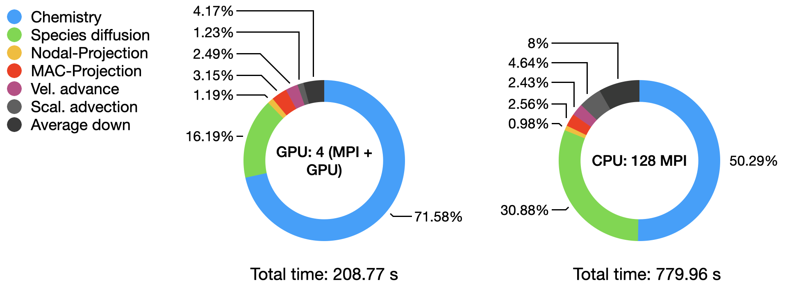
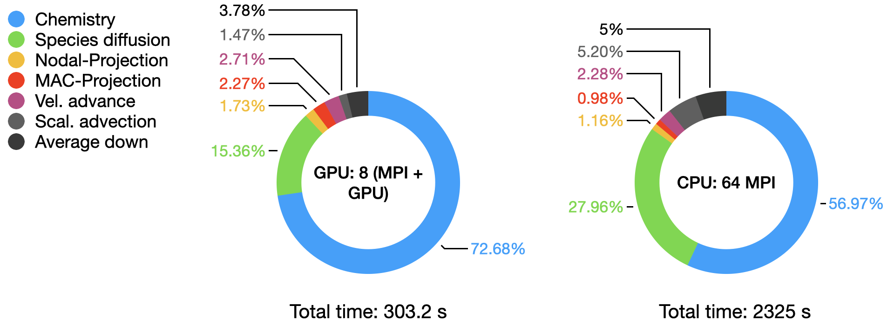
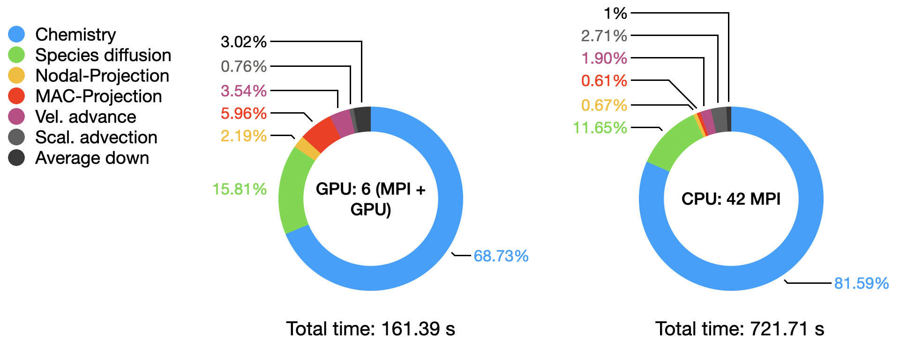
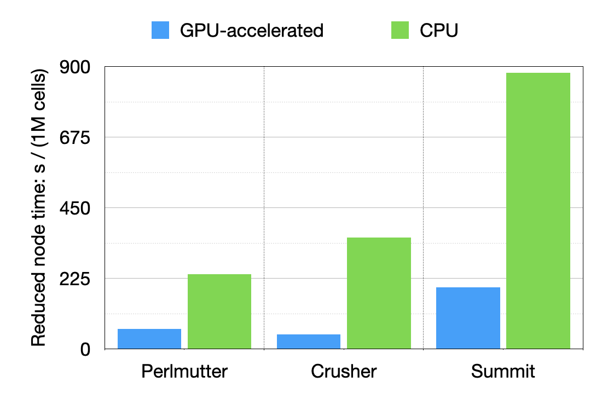
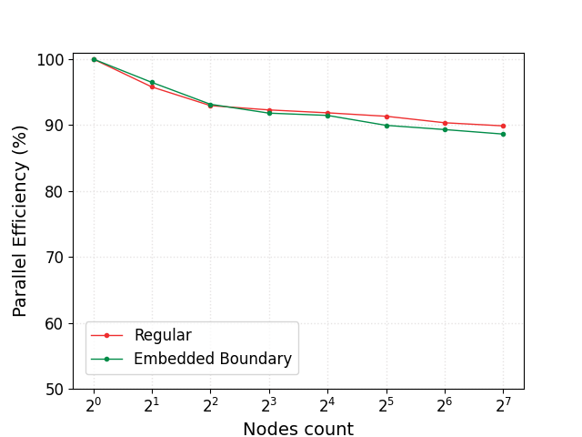

Performances
============

`PeleLMeX` development was driven by the need to create a simulation code efficiently
leveraging the computational power of ExaScale super-computers. As mentioned earlier,
`PeleLMeX` is built upon the AMR library `AMReX` and inherits most of its High Performance Computing
features.

`PeleLMeX` parallel paradigm is based on an MPI+`X` appraoch, where `X` can be OpenMP, or any of
CUDA, HIP or SYCL, for Nvidia, AMD and Intel GPUs vendor, respectively. The actual performances
gain of using accelerator within `PeleLMeX` is a moving target as both hardware and software are
continously improving. In the following we demonstrate the gain at a given time (specified and
subject to updates) and on selected platforms.

Single node performances: FlameSheet case
-----------------------------------------

Case description
^^^^^^^^^^^^^^^^

The simple case of a laminar premixed flame with harmonic perturbation can be found in
`Exec/RegTests/FlameSheet`. For the following test, the mixture is composed of
dodecane and air at ambient temperature and pressure. The chemical mechanism used consist
of 35 transported species and 18 species assumed in Quqsi-Steady State (QSS) and the `Simple`
transport model with the `Fuego` EOS is used:

::

    Chemistry_Model = dodecane_lu_qss
    Eos_Model       = Fuego
    Transport_Model = Simple

The initial solution is provided from a Cantera simulation and averaged on the cartesian grid.
The input file `Exec/RegTests/FlameSheet/inputs.3d_DodecaneQSS` is used, with modifications detailed hereafter.
Simulations are conducted at a fixed time step size for 16 steps, bypassing the initial reduction of
the time step size usually employed to remove artifacts from the initial data:

::

    amr.max_step = 16
    amr.dt_shrink = 1.0
    amr.fixed_dt = 2.5e-7

Additionnaly, unless otherwise specified, all the tests on GPUs are conducted
using the MAGMA dense-direct solver to solve for the Newton direction within CVODE's non-linear integration.

::

    cvode.solve_type = magma_direct

and the dense direct analytical Jacobian solver on CPUs:

::

    cvode.solve_type = denseAJ_direct

The actual number of cells in each direction and the number of levels will depends on the amount
of memory available on the different platform and will be specified later on.

Results on Perlmutter (NERSC)
^^^^^^^^^^^^^^^^^^^^^^^^^^^^^

Perlmutter's `GPU nodes <https://docs.nersc.gov/systems/perlmutter/architecture/#gpu-nodes>`_ consists of a single AMD EPYC 7763 (Milan)
CPU connected to 4 NVIDIA A100 GPUs. The `CPU nodes <https://docs.nersc.gov/systems/perlmutter/architecture/#cpu-nodes>`_ consists of
two of the same AMD EPYC, 64-cores CPUs. When running on the GPU node, `PeleLMeX` will use 4 MPI ranks with each access to one A100, while
when running on a CPU node, we will use 128 MPI-ranks.

The FlameSheet case is ran using 2 levels of refinement (3 levels total) and the following domain size and cell count:

::

    geometry.prob_lo     = 0.0 0.0 0.0        # x_lo y_lo (z_lo)
    geometry.prob_hi     = 0.008 0.016 0.016  # x_hi y_hi (z_hi)

    amr.n_cell           = 32 64 64
    amr.max_level        = 2

leading to an initial cell count of 3.276 M, i.e. 0.8M/cells per GPU. The git hashes of `PeleLMeX` and its dependencies for
these tests are:

::

     ================= Build infos =================
     PeleLMeX    git hash: v22.12-dirty
     AMReX       git hash: 22.12-1-g4a53367b1-dirty
     PelePhysics git hash: v0.1-1052-g234a8089-dirty
     AMReX-Hydro git hash: d959ee9
     ===============================================

The graph below compares the timings of the two runs obtained from `AMReX` TinyProfiler.
Inclusive averaged data are presented here, for separates portion of the `PeleLMeX` algorithm
(see the `algorithm page <https://amrex-combustion.github.io/PeleLMeX/manual/html/Model.html#pelelmex-algorithm>`_ for more
details):

The total time comparison shows close to a 4x speed-up on a node basis on this platform, with the AMD Milan CPU being amongst
the most performant to date. The detailed distribution of the computational time within each run highlight the dominant contribution
of the stiff chemistry integration, especially on the GPU.

Results on Crusher (ORNL)
^^^^^^^^^^^^^^^^^^^^^^^^^

Crusher is the testbed for DOE's first ExaScale platform Frontier. `Crusher's nodes <https://docs.olcf.ornl.gov/systems/crusher_quick_start_guide.html#crusher-compute-nodes>`_ consists of a single AMD EPYC 7A53 (Trento), 64 cores CPU connected to 4 AMD MI250X,
each containing 2 Graphics Compute Dies (GCDs) for a total of 8 GCDs per node. When running with GPU acceleration, `PeleLMeX` will use 8 MPI ranks with each access to one GCD, while when running on flat MPI, we will use 64 MPI-ranks.

The FlameSheet case is ran using 2 levels of refinement (3 levels total) and the following domain size and cell count:

::

    geometry.prob_lo     = 0.0 0.0 0.0        # x_lo y_lo (z_lo)
    geometry.prob_hi     = 0.016 0.016 0.016  # x_hi y_hi (z_hi)

    amr.n_cell           = 64 64 64
    amr.max_level        = 2

leading to an initial cell count of 6.545 M, i.e. 0.8M/cells per GPU. The git hashes of `PeleLMeX` and its dependencies for
these tests are:

::

     ================= Build infos =================
     PeleLMeX    git hash: v22.12-15-g769168c-dirty
     AMReX       git hash: 22.12-15-gff1cce552-dirty
     PelePhysics git hash: v0.1-1054-gd6733fef
     AMReX-Hydro git hash: cc9b82d
     ===============================================

The graph below compares the timings of the two runs obtained from `AMReX` TinyProfiler.
Inclusive averaged data are presented here, for separates portion of the `PeleLMeX` algorithm
(see the `algorithm page <https://amrex-combustion.github.io/PeleLMeX/manual/html/Model.html#pelelmex-algorithm>`_ for more
details):

The total time comparison shows more than a 7.5x speed-up on a node basis on this platform,
The detailed distribution of the computational time within each run highlight the dominant contribution
of the stiff chemistry integration, especially on the GPU.

Results on Summit (ORNL)
^^^^^^^^^^^^^^^^^^^^^^^^

Summit was launched in 2018 as the first DOE's fully GPU-accelerated platform.
`Summit's nodes <https://docs.olcf.ornl.gov/systems/summit_user_guide.html#summit-nodes>`_ consists
of a two IBM Power9 CPU connected to 6 NVIDIA V100 GPUs. When running with GPU acceleration, `PeleLMeX` will
use 6 MPI ranks with each access to one V100, while when running on flat MPI, we will use 42 MPI-ranks.
Note that in contrast with newer GPUs available on Perlmutter or Crusher, Summit's V100s only have 16GBs of
memory which limit the number of cells/GPU. For this reason, the chemical linear solver used within Sundials is
modified to the the less memory demanding *cuSparse* solver:

::

    cvode.solve_type = sparse_direct

The FlameSheet case is ran using 2 levels of refinement (3 levels total) and the following domain size and cell count:

::

    geometry.prob_lo     = 0.0 0.0 0.0        # x_lo y_lo (z_lo)
    geometry.prob_hi     = 0.004 0.008 0.016  # x_hi y_hi (z_hi)

    amr.n_cell           = 16 32 64
    amr.max_level        = 2

leading to an initial cell count of 0.819 M, i.e. 0.136M/cells per GPU. The git hashes of `PeleLMeX` and its dependencies for
these tests are:

::

     ================= Build infos =================
     PeleLMeX    git hash: v22.12-15-g769168c-dirty
     AMReX       git hash: 22.12-15-gff1cce552-dirty
     PelePhysics git hash: v0.1-1054-gd6733fef
     AMReX-Hydro git hash: cc9b82d
     ===============================================

The graph below compares the timings of the two runs obtained from `AMReX` TinyProfiler.
Inclusive averaged data are presented here, for separates portion of the `PeleLMeX` algorithm
(see the `algorithm page <https://amrex-combustion.github.io/PeleLMeX/manual/html/Model.html#pelelmex-algorithm>`_ for more
details):

The total time comparison shows close to a 4.5x speed-up on a node basis on this platform,
The detailed distribution of the computational time within each run highlight the dominant contribution
of the stiff chemistry integration,

System comparison
^^^^^^^^^^^^^^^^^

It is interesting to compare the performances of each system on a node basis, normalizing by the number of cells
to provide a node time / million of cells.

Results show that a 3x and 4.2x speed is obtained on a node basis going from Summit to more recent
Perlmutter or Crusher, respectively.

Weak scaling performances: FlameSheet case
------------------------------------------

Case description
^^^^^^^^^^^^^^^^

Once again the case of a laminar premixed flame with harmonic perturbations is employed. On
a single node, the case is similar to the one used in the previous section. To perform the
weak scaling study (characterising the ability of the solver to scale up while keeping the
same amount of work per compute unit), the dimentions of the computational domain are
increased by a factor 2 in :math:`x` and :math:`y` alternatively as the number of
compute nodes is doubled. The periodicity of the initial conditions allow to ensure
that the amount of work per node remains constant.

To provide a more comprehensive test of `PeleLMeX`, the scaling study is also reproduced in the case
of a flame freely propagating in a quiescient mixture towards an EB flat wall. The presence of the
EB triggers numerous changes in the actual code path employed (from advection scheme to linear solvers).

The stude is performed on ORNL's Crusher machine and the FlameSheet case is ran using 2 levels
of refinement (3 levels total) and the following domain size and cell count:

::

    geometry.prob_lo     = 0.0 0.0 0.0        # x_lo y_lo (z_lo)
    geometry.prob_hi     = 0.016 0.016 0.016  # x_hi y_hi (z_hi)

    amr.n_cell           = 64 64 64
    amr.max_level        = 2

When introducing the EB plane, the following EB definition is employed:

::

     eb2.geom_type     = plane
     eb2.plane_point   = 0.00 0.00 0.0004
     eb2.plane_normal  = 0 0 -1.0

and because nothing interesting is happening at the EB surface, it is maintained on the base
level using the following parameters:

::

     peleLM.refine_EB_type = Static
     peleLM.refine_EB_max_level = 0
     peleLM.refine_EB_buffer = 2.0

The parallel efficiency, defined as the time to solution obtained on a single node divided by the
time to solution obtained with an increasing number of nodes is reported in the figure below
for the case wo. EB and w. EB. The efficiency is found to drop to 90% when going from 1 to 128
Crusher nodes (8 to 1024 GPUs) and a closer look at the scaling data shows that most of the
efficiency loss is associated with the communication intensive linear solves.

