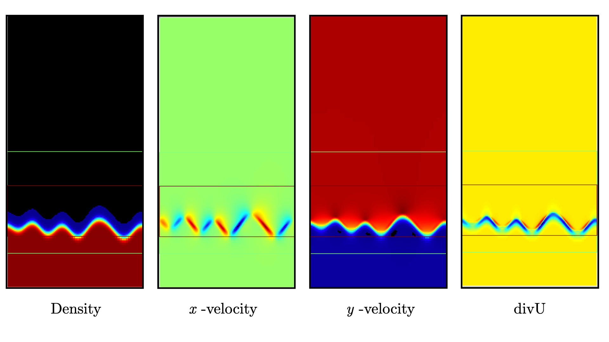
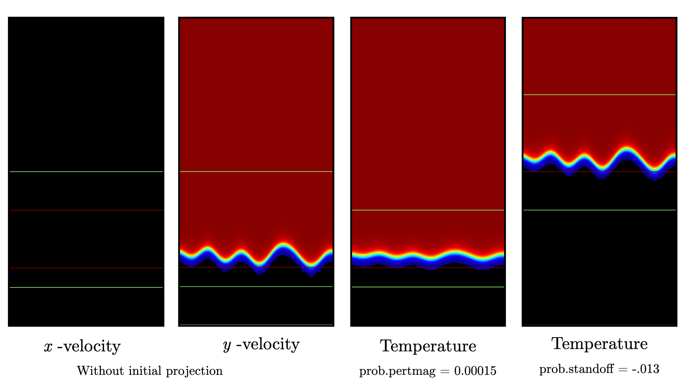
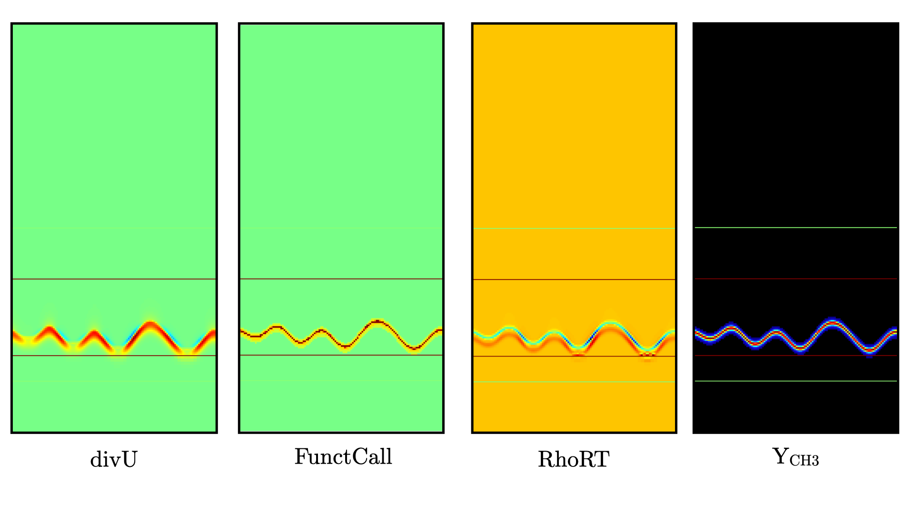
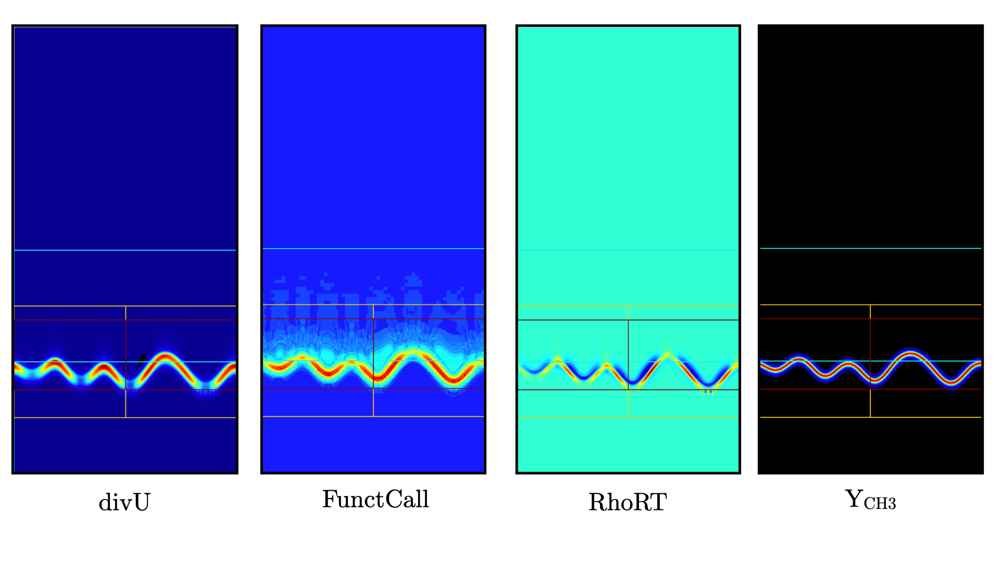

.. highlight:: rst

.. _sec:tutorialFlameSheet:

Premixed flame sheet with harmonic perturbations
================================================

.. _sec:TUTO_FS::Intro:

Introduction
------------
`PeleLMeX` primary objective is to enable simulation of reactive flows on platforms ranging
from small personal computer to Exascale supercomputer. This short tutorial describes
the case of a 2D laminar methane/hydrogen/air premixed flame, perturbed using harmonic fluctuations
on the initial conditions.

The goal of this tutorial is to demonstrate `PeleLMeX` basic controls when dealing with reactive simulations.
This document provides step by step instructions reviewing how to set-up the domain and boundary conditions,
and how to construct an initial solution.

..  _sec:TUTO_FS::PrepStep:

Setting-up your environment
---------------------------

Getting a functioning environment in which to compile and run `PeleLMeX` is the first step of this tutorial.
Please review the requirements listed on the `PeleLMeX README <https://github.com/AMReX-Combustion/PeleLMeX/blob/development/README.md>`_ to ensure
you have a suitable compiler suite to build `PeleLMeX`.
Follow the steps listed below to get the source code and its dependent libraries:

#. The first step consist in getting `PeleLMeX` and its dependencies. To do so, use a recursive *git clone*: ::

    git clone --recursive https://github.com/AMReX-Combustion/PeleLMeX.git

#. Move into the Exec folder containing the ``FlameSheet``. To do so: ::

    cd PeleLMeX/Exec/RegTests/FlameSheet

Note that the makefile system is set up such that default paths are automatically set to the
submodules obtained with the recursive *git clone*, however the user can set their own dependencies
in the `GNUmakefile` by updating the top-most lines as follows: ::

       PELELMEX_HOME     = <path_to_PeleLMeX>
       AMREX_HOME        = <path_to_MyAMReX>
       AMREX_HYDRO_HOME  = <path_to_MyAMReXHydro>
       PELE_PHYSICS_HOME = <path_to_MyPelePhysics>
       SUNDIALS_HOME     = <path_to_MySUNDIALS>

or directly through shell environment variables (using *bash* for instance): ::

       export PELELMEX_HOME=<path_to_PeleLMeX>
       export AMREX_HOME=<path_to_MyAMReX>
       export AMREX_HYDRO_HOME=<path_to_MyAMReXHydro>
       export PELE_PHYSICS_HOME=<path_to_MyPelePhysics>
       export SUNDIALS_HOME=<path_to_MySUNDIALS>

Note that using the first option will overwrite any
environment variables you might have previously defined when using this `GNUmakefile`.

You're good to go !

Case setup
----------

A `PeleLMeX` case folder generally contains a minimal set of files to enable compilation,
provide user-defined functions defining initial and boundary conditions, input file(s) and
any additional files necessary for the simulation (solution of a Cantera 1D flame for instance).

The following three files in particular are necessary: ::

        pelelmex_prob_parm.H
        pelelmex_prob.H
        pelelmex_prob.cpp

The first file provides a C++ struct `ProbParm` containing the set of user-defined variables
used during the simulation (value of inlet temperature, amplitude of the initial
perturbation, ...). The `.cpp` file uses AMReX `ParmParse` to read these run-time
parameter and initialize the `ProbParm` container values. Finally, `pelelmex_prob.H`
provides C++ kernels for the initial and boundary conditions and will be detailed
later in this tutorial.

The following review the content of the various files required for the flame sheet test case.
User keys listed in the `input.2d-regt` file are reviewed and linked to the specific aspects
of the simulation setup. To get additional information about the keywords discussed,
the reader is referred to :doc:`LMeXControls`.

Geometry, grid and boundary conditions
^^^^^^^^^^^^^^^^^^^^^^^^^^^^^^^^^^^^^^

This Direct Numerical Simulations (DNS) is performed on a 0.016x0.032 :math:`m^2` 2D computational domain,
with the bottom left corner located at (0.0:0.0) and the top right corner at (0.016:0.032). Periodic boundary
conditions are used in the transverse (:math:`x`) direction, while ``Inflow`` (dirichlet) and ``Outflow`` (0-neumann) boundary
are used in the main flow direction (:math:`y`). The flow goes from bottom to top. Finally a Cartesian coordinate system is
used here. All of the above information is provided in the first two blocks of the input file: ::

   #---------------------- DOMAIN DEFINITION -------------------------
   geometry.is_periodic = 1 0             # Periodicity in each direction: 0 => no, 1 => yes
   geometry.coord_sys   = 0               # 0 => cart, 1 => RZ
   geometry.prob_lo     = 0.0   0.0       # x_lo y_lo
   geometry.prob_hi     = 0.016 0.032     # x_hi y_hi

   #---------------------- BC FLAGS ----------------------------------
   # Interior, Inflow, Outflow, Symmetry,
   # SlipWallAdiab, NoSlipWallAdiab, SlipWallIsotherm, NoSlipWallIsotherm
   peleLM.lo_bc = Interior Inflow         # bc in x_lo y_lo (z_lo)
   peleLM.hi_bc = Interior Outflow        # bc in x_hi y_hi (z_hi)

.. note::
    Note that `Interior` BC must be imposed in the direction specified as periodic with `geometry.is_periodic`.

The base grid is decomposed into a 32x64 cells array, and initially 2 levels of refinement are used.
When running serial, a single box is used on the base level as the ``amr.max_grid_size`` exceeds the
number of cells in each direction. When running parallel, the base grid will be chopped into smaller
boxes in the limit that no box smaller than the ``amr.blocking_factor`` can be created (16 :math:`^2` here).

The refinement ratio between each level is set to 2 and `PeleLMeX` currently does not support
refinement ratio of 4. Regrid operation will be performed every 5 steps. ``amr.n_error_buf`` specifies,
for each level, the number of buffer cells used around the cell tagged for refinement, while ``amr.grid_eff``
describes the grid efficiency, i.e. how much of the new grid contains tagged cells. Higher values lead
to tighter grids around the tagged cells.

All of those parameters are specified in the `AMR CONTROL` block: ::

   #------------------------- AMR CONTROL ----------------------------
   amr.n_cell          = 32 64            # Level 0 number of cells in each direction
   amr.max_level       = 2                # maximum level number allowed
   amr.ref_ratio       = 2 2 2 2          # refinement ratio
   amr.regrid_int      = 5                # how often to regrid
   amr.n_error_buf     = 1 1 2 2          # number of buffer cells in error est
   amr.grid_eff        = 0.7              # what constitutes an efficient grid
   amr.blocking_factor = 16               # block factor in grid generation
   amr.max_grid_size   = 256              # maximum box size

Problem specifications
^^^^^^^^^^^^^^^^^^^^^^

..  _sec:TUTO_FS::Problem:

The problem setup is mostly contained in the three C++ source/header files mentioned above. Looking into ``pelelmex_prob_parm.H`` first,
we can see the set of parameters that will be used to specify the initial and boundary conditions: ::

    struct ProbParm
    {
       amrex::Real P_mean   = 101325.0_rt;
       amrex::Real standoff = 0.0_rt;
       amrex::Real pertmag  = 0.0004_rt;
       amrex::Real pertlength  = 0.008_rt;
    };

Because initial and boundary conditions for this case are mostly extracted from a 1D freely propagating
premixed flame solution obtained with Cantera, only a handful of parameters need to be specified.
The ``standoff`` parameter controls the position of the interpolated Cantera solution on the `PeleLMeX`
domain while ``pertmag`` and ``pertlength`` control the amplitude and transerve length of the
harmonic perturbations, respectively. Default values are provided for all the parameter. Note that the domain
transverse size (the :math:`x` length here) must be a multiple of the ``pertlength`` in order to ensure
periodicity of the initial solution.

.. note::
   The ``P_mean`` parameters, providing the initial thermodynamic pressure, is always needed in the ProbParm struct.

Looking now into ``pelelmex_prob.cpp``, we can see how the developer can provide access to the `ProbParm` parameters
to overwrite the default values using AMReX's ParmParse: ::

    void PeleLM::readProbParm()
    {
       amrex::ParmParse pp("prob");

       std::string type;
       pp.query("P_mean",   PeleLM::prob_parm->P_mean);
       pp.query("standoff", PeleLM::prob_parm->standoff);
       pp.query("pertmag",  PeleLM::prob_parm->pertmag);
       pp.query("pertlength",  PeleLM::prob_parm->pertlength);

       PeleLM::pmf_data.initialize();
    }

The `PeleLMeX` has its own `ProbParm` instance, the values of which are set by the ``query`` function calls. Note that because a
``query`` function is employed, the solver will use the default values of the ``ProbParm`` parameters if they are not provided
in the input file. Use a ``pp.get`` to throw an error if overwriting the default value is desirable (see AMReX's ParmParse
documentation for more information). Users can now add the corresponding keys to their input file: ::

    prob.P_mean = 101325.0
    prob.standoff = -.023
    prob.pertmag = 0.00045
    prob.pertlength = 0.016

Additionally, the `readProbParm()` function initialize another data structure designed to handle the Cantera solution
(not detailed here). When this function is called, users must provide the path to the Cantera solution stored as an
ASCII file in the input file: ::

    pmf.datafile = "drm19_pmf.dat"

Finally, ``pelelmex_prob.H`` defines the two functions effectively filling the initial solution and boundary conditions:
`pelelmex_initdata` and `bcnormal`. The arguments of the `pelelmex_initdata` function are as follows:

* ``int i, int j, int k,`` : indices of the current grid cell the function is called to fill

* ``int /*is_incompressible*/,`` : flag indicating if `PeleLMeX` is running a pure incompressible case

* ``amrex::Array4<amrex::Real> const& state,`` : a lightweight array structure enabling access to the grid state data

* ``amrex::Array4<amrex::Real> const& /*aux*/,`` : similar array structure but for the auxiliaries data

* ``amrex::GeometryData const& geomdata,`` : an AMReX object containing geometrical data of the current level

* ``ProbParm const& prob_parm,`` : the `ProbParm` struct

* ``pele::physics::PMF::PmfData::DataContainer const * pmf_data`` : the Cantera solution data struct

The reader is encouraged to look into the body of the `pelelmex_initdata` function for more details, a skeletal
version of the function reads:

* Compute the coordinate of the cell center using the cell indices and the `geomdata`.

* Compute the harmonic perturbation.

* Using ``standoff`` and the perturbation, use the ``PMF`` function to get cell-average temperature, mole fractions and
  velocity from the Cantera solution.

* Use the data from the ``PMF`` to set the state array: velocities, density, rhoYs, rhoH and temperature. Relying on
  EOS calls and using `ProbParm::P_mean`.

Some of the arguments of the `bcnormal` should now be familiar. The coordinates of the cell where the function
is called are now directly passed into the function and the outgoing state vector is now ``s_ext``. The ``idir``
and ``sgn`` `ints` can be used to easily determine on which domain face the function in called. Once again, the
state vector is extracted from the ``PMF`` function to match the operating conditions of the Cantera flame. This
function is only called in the direction/orientation where a Dirichlet boundary condition is imposed, i.e. the
:math:`y`-low domain face here since the transverse direction is periodic and the outflow is an homogeneous
Neumann for the state components.

A last function, ``zero_visc``, is included in ``pelelmex_prob.H`` but is not used in the present case.

Numerical parameters
^^^^^^^^^^^^^^^^^^^^

The ``PeleLMeX CONTROL`` block contains a few of the `PeleLMeX` algorithmic parameters. Many more
unspecified parameters are relying on their default values which can be found in :doc:`LMeXControls`.
Of particular interest are the ``peleLM.sdc_iterMax`` parameter controlling the number of
SDC iterations (see :doc:`Model` for more details on SDC in `PeleLMeX`) and the
``peleLM.num_init_iter`` one controlling the number of initial iteration the solver will do
after initialization to obtain a consistent pressure and velocity field.

Building the executable
-----------------------

Now that we have reviewed the basic ingredients required to setup the FlameSheet case, it is time to build the `PeleLMeX` executable.
Although both GNUmake and CMake are available, it is advised to use GNUmake. The ``GNUmakefile`` file provides some compile-time options
regarding the simulation we want to perform.
The first few lines specify the paths towards the source codes of `PeleLMeX`, `AMReX`, `AMReX-Hydro` and `PelePhysics`, overwriting
any environment variable if necessary, and might have been already updated in :ref:`sec:TUTO_FS::PrepStep` earlier.

The next few lines specify AMReX compilation options and compiler selection: ::

   # AMREX
   DIM             = 2
   DEBUG           = FALSE
   PRECISION       = DOUBLE
   VERBOSE         = FALSE
   TINY_PROFILE    = FALSE

   # Compilation
   COMP            = gnu
   USE_MPI         = TRUE
   USE_OMP         = FALSE
   USE_CUDA        = FALSE
   USE_HIP         = FALSE
   USE_SYCL        = FALSE

It allows users to specify the number of spatial dimensions (2D), trigger debug compilation and other AMReX options.
The compiler (``gnu``) and the parallelism paradigm (in the present case only MPI is used) are then selected. If MPI is not available on your
platform, please set ``USE_MPI = FALSE``.
Note that on OSX platform, one should update the compiler to ``llvm``.

In `PeleLMeX`, the chemistry model (set of species, their thermodynamic and transport properties as well as the description of their of chemical interactions) is specified at compile time. Chemistry models available in `PelePhysics` can used in `PeleLMeX` by specifying the name of the folder in `PelePhysics/Support/Mechanisms/Models` containing the relevant files, for example: ::

   Chemistry_Model = drm19

Here, the model ``drm19``, contains 21 species and describe the chemical decomposition of methane.
The user is referred to the `PelePhysics <https://pelephysics.readthedocs.io/en/latest/>`_ documentation for a
list of available mechanisms and more information regarding the EOS, chemistry and transport models specified: ::

    Eos_Model       := Fuego
    Transport_Model := Simple

Note that the ``Chemistry_Model`` must be similar to the one used to generate the Cantera solution.

Finally, `PeleLMeX` utilizes the chemical kinetic ODE integrator `CVODE <https://computing.llnl.gov/projects/sundials/cvode>`_. This
Third Party Library (TPL) is shipped as a submodule of the `PeleLMeX` distribution and can be readily installed through the makefile system
of `PeleLMeX`. To do so, type in the following command: ::

    make -j4 TPL

Note that the installation of `CVODE` requires CMake 3.23.1 or higher.

You are now ready to build your first `PeleLMeX` executable !! Type in: ::

    make -j4

The option here tells `make` to use up to 4 processors to create the executable (internally, `make` follows a dependency graph to ensure any required ordering in the build is satisfied). This step should generate the following file (providing that the build configuration you used matches the one above): ::

    PeleLMeX2d.gnu.MPI.ex

You're good to go!

Checking the initial conditions
-------------------------------

As a first step, we will run the simulation performing only the initialization and visualize the initial
condition, while varying some of the problem parameters. To do so, we need to update the
time stepping block to specify the number of time steps.

Open the ``input.2d-regt`` with your favorite editor and update the following parameters ::

    #---------------------- Time Stepping CONTROL --------------------
    amr.max_step      = 0             # Maximum number of time steps
    amr.stop_time     = 0.025         # final physical time
    amr.max_wall_time = 0.1           # Maximum simulation run time
    amr.cfl           = 0.5           # cfl number for hyperbolic system
    amr.dt_shrink     = 0.0001        # scale back initial timestep
    amr.dt_change_max = 1.1           # Maximum dt increase btw successive steps

We've specified three condition upon which `PeleLMeX` will end the simulation: a maximum number of time steps,
a maximum physical simulation time and a maximum wallclock time. As soon as one of these condition is met, the
code will exit. The time step size is based on a hydrodynamic CFL set here at 0.5, but this estimated value
is multiplied by ``amr.dt_shrink`` upon initialization to more smoothly eliminate any numerical noise
arising from the state vector initial solution. The step size then relax to the CFL-constrained dt at
a rate controlled by ``amr.dt_change_max``.

We've set the maximum number of steps to 0 such the solver will exit after
the initial solution is obtained. Let's run the simulation with the default problem parameter
listed in the input file. To do so, use: ::

    ./PeleLMeX2d.gnu.MPI.ex input.2d-regt

A number of information are printed to the screen:

#. AMReX/SUNDIALs initialization along with the git hashes of the various subrepositories

#. A summary of the `PeleLMeX` state components

#. `PeleLMeX` structs initialization: transport, reactor, ``PMF`` Cantera structure, AMR hierarchy, ...

#. Initial projection and initial iterations.

#. Saving the initial solution to `plt00000` file.

Use Amrvis, Paraview or yt to visualize the plot file. Using Amrvis, the solution should look
similar to :numref:`FS_InitSol`.

   : Contour plots of density, velocity components and velocity divergence constraint after initialization.

It is interesting to note that the initial solution has a transverse velocity component
even though only the axial velocity was extracted from a 1D Cantera solution to initialize
the solution in the `pelelmex_initdata` function. This is because `PeleLMeX` performs an
initial projection (more than one actually). At this point, the `divU` constraint is
mostly negative, which is counter-intuitive for a flame, but this is the consequence of
the initialization process and the solution will rapidly relax to adapt to the `PeleLMeX` grid.

Let's now play with the problem parameters to see how the initial solution changes. For instance,
decrease the amplitude of the perturbation, change the ``standoff`` parameter or deactivate the
initial projection by adding ``peleLM.do_init_proj=0`` to the ``PeleLMeX CONTROL`` block. Examples
of the initial solution varying these parameters are displayed in :numref:`FS_InitTweaks`.

   : Contour plots of velocity components without initial projection and temperature using tweaked problem parameter.

Advance the solution
--------------------

So far, we haven't advanced the solution at all. Restore the problem parameters to their initial values,
re-activate the initial projection and let's now run the simulation for 50 steps and save a checkpoint
file from which to restart from. To do so, ensure that: ::

    amr.max_step = 50

and uncomment the following line to require writing checkpoint files: ::

    amr.check_int = 2000

As soon as this last key is specified, `PeleLMeX` will write an initial and final checkpoint file.
Note that checkpoint file and plotfile store different data. A checkpoint file will store all the necessary
state data to enable a continuous restart of the simulation, i.e. the solution after 50 steps is exactly the
same as the one obtained running 25 steps first, then restarting for another 25 steps. A plotfile will
not necessarily contains the entire state and also includes a number of `derived` variables of interest
to analyse the simulation. The content of a plotfile can be controlled by users using: ::

    amr.derive_plot_vars = avg_pressure mag_vort mass_fractions mixture_fraction progress_variable

Here we require the cell-averaged pressure, the vorticity, species mass fraction (remember that
`PeleLMeX` state contains rhoYs not Ys), mixture fraction and progress variable to be added to the
plotfile. For a complete list of `PeleLMeX` available `derived`, see the adequate section in :doc:`LMeXControls`.

Additionally, increase `PeleLMeX` verbose in order to better see the various steps of the
algorithm: ::

    peleLM.v = 3

And start the simulation from the beginning again: ::

    ./PeleLMeX2d.gnu.MPI.ex input.2d-regt

Using a single processor, it takes about one minute to complete the 50 time steps.
A typical `PeleLMeX` stdout for a time step now looks like: ::

    ==============================================================================
    Est. time step - Conv: 1.794426504e-05, divu: 0.0002454786986
    STEP [10] - Time: 1.892958943e-09, dt 3.080703507e-10
      SDC iter [1]
      - oneSDC()::MACProjection()   --> Time: 0.017529
      - oneSDC()::ScalarAdvection() --> Time: 0.027038
      - oneSDC()::ScalarDiffusion() --> Time: 0.104103
      - oneSDC()::ScalarReaction()  --> Time: 0.220751
      SDC iter [2]
      - oneSDC()::Update t^{n+1,k}  --> Time: 0.103966
      - oneSDC()::MACProjection()   --> Time: 0.012029
      - oneSDC()::ScalarAdvection() --> Time: 0.027831
      - oneSDC()::ScalarDiffusion() --> Time: 0.082195
      - oneSDC()::ScalarReaction()  --> Time: 0.236054
      - Advance()::VelocityAdvance  --> Time: 0.04529
    >> PeleLM::Advance() --> Time: 1.07867

clearly showing the use of 2 SDC iterations and the time spent
performing projection, computing scalar advection, diffusion and reaction,
and finally performing the velocity advance. The reader is referred to
:doc:`Model` for a detailed description of all of these steps.

The first line at each step provide the time step constraint from the CFL
condition (``Conv:``) and from the density change condition (``divu:``).
Since an initial ``dt_shrink`` was applied upon initialization, the
current step is much smaller than the CFL but progressively increases
over the course of the 50 steps.

Visualizing the `plt00050` file, we can see that the solution has not
changed much from the initial solution at this point (only a fraction of
a microsecond runtime has been reached). It is still interesting to
look more closely at `divU`, `FunctCall`, the thermodynamic pressure and
an intermediate species such as CH3 in :numref:`FS_50steps`.

   : Contour plots of `divU`, `FunctCall`, thermodynamic pressure and CH3 mass fraction after 50 steps.

The `divU` is now mostly positive, consistent with the thermal expansion occurring across a
flame front. The `FunctCall` is the number of calls to the chemical right-hand-side function
used in the chemical integrator CVODE. Higher values are indicative of locally stiffer
chemical ODE system, concentrated in the reactive layer of the flame. The `RhoRT` variable
is the thermodynamic pressure: within `PeleLMeX` low Mach number approach, this should be
perfectly uniform in space. However to conserve mass and enthalpy, the `PeleLMeX` algorithm allows
for small deviation from this constraint. In the current case, deviation do not extend 0.0001 Pa,
but larger deviations (> 100-1000 Pa) can be indicative that more SDC iterations are necessary or that the time step
size is too large. Finally, we can see from looking at the CH3 mass fraction that the current
spatial resolution is barely able to capture the internal flame structure.

Let's now continue the simulation, restarting from the `chk00050` file and adding another level
of refinement. To do so, uncomment the following line: ::

    amr.restart = chk00050

Increase the ``max_step`` to 120 and increase the maximum level to 3: ::

    amr.max_level       = 3

And restart the simulation, now using more than one MPI ramk if possible: ::

    mpirun -n 2 ./PeleLMeX2d.gnu.MPI.ex input.2d-regt

Because the step size keeps increasing, the physical simulation time after 120
steps is now around 0.1 ms. Upon restarting the simulation, a third refinement level
was added as requested: ::

    ====================   NEW TIME STEP   ====================
    Regridding...
    Remaking level 1
    with 4096 cells, over 50% of the domain
    Remaking level 2
    with 8192 cells, over 25% of the domain
    Making new level 3 from coarse
    with 20480 cells, over 15.625% of the domain
    Resetting fine-covered cells mask
    Update chemistry typical values

The finest level contains more cells than the sum of all the other levels
while only occupying about 15% of the domain, showing how AMR is able to
provide local refinement only around the location of interest. In the present case,
refinement is triggered by a threshold value on the H species. This option
is specified in the input file using: ::

    #---------------------- Refinement CONTROL------------------------
    amr.refinement_indicators = yH
    amr.yH.max_level     = 3
    amr.yH.value_greater = 1.0e-6
    amr.yH.field_name    = Y(H)

Users can freely add additional refinement indicator to trigger refinement
is other part of the domain. Note also that if we were to add another level
of refinement, the ``amr.yH.max_level`` should be increased in order to
trigger refinement up to level 4 with this criteria.

:numref:`FS_120steps` shows the same variables as :numref:`FS_50steps`.
`divU` is now almost entirely positive and shows lower values near the tip
of the flame cusps as expected from a lean methane/air flame (the amount of
hydrogen in the inlet stream is small). The scale of `FunctCall` increased
from a maximum of 12 to 35, indicating that as the step size is increased,
CVODE requires more RHS call to integrate the chemical system. Similarly,
`RhoRT` is found to deviate more from the 1 Atm uniform value, up to 25 Pa. also
as a consequence of the large time step size (about 10 :math:`\mu s` by the end of the
simulation). Finally, the CH3 mass fraction field show that the intermediate
species is now resolved on more than a single cell (but more refienement would be
necessary if this species was of special interest).

   : Contour plots of `divU`, `FunctCall`, thermodynamic pressure and CH3 mass fraction after 120 steps.

This is the end of this short tutorial introducing the basics of reactive flow simulations
with `PeleLMeX`. More advanced aspects of the code are described in other tutorials and
readers can peruse the numerous case folders available in `Exec` to find example in order
to set their own case.
