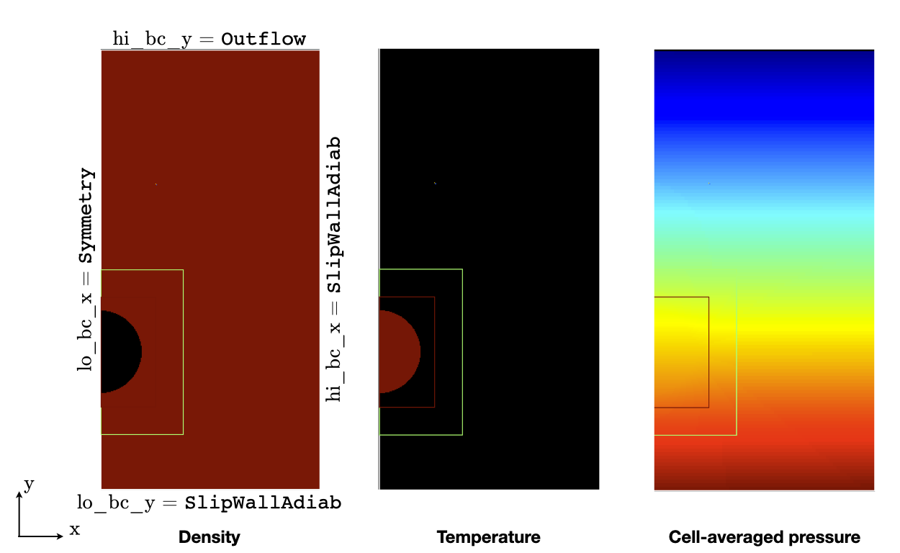
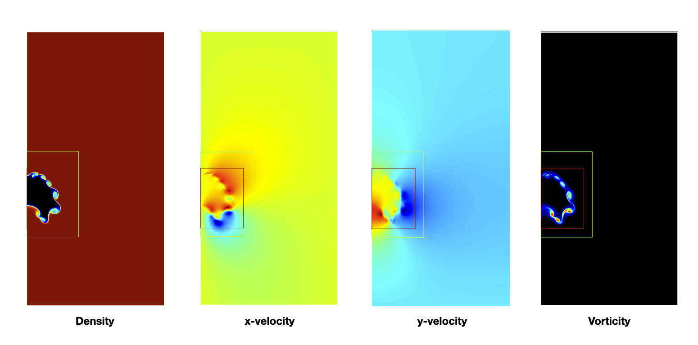

.. highlight:: rst

.. _sec:tutorialHB:

Rising light bubble
===================

.. _sec:TUTO_HB::Intro:

Introduction
------------

At the core of `PeleLMeX` algorithm is a variable-density, low Mach number Navier-Stokes solver based
on a fractional step approach. This short ``HotBubble`` tutorial presents the case of a rising light bubble under
the influence of a gravity field, which exercice this algorithm without the added complexity
of chemical reactions or embedded boundaries.

..  _sec:TUTO_HB::PrepStep:
.. include:: Tutorials_SettingUp.rst

Case setup
----------

A `PeleLMeX` case folder contains a minimal set of files to enable compilation,
and the reader is referred to the FlameSheet tutorial :doc:`Tutorials_FlameSheet` for a
more detailed description of `PeleLMeX` case setup. The case of interest for this
tutorial can be found in `PeleLMeX` Exec folder: ::

    Exec/RegTests/HotBubble

Geometry, grid and boundary conditions
^^^^^^^^^^^^^^^^^^^^^^^^^^^^^^^^^^^^^^

This simulation is performed on a 0.016x0.032 :math:`m^2` 2D computational domain,
with the bottom left corner located at (0.0:0.0) and the top right corner at (0.016:0.032).
Two versions of that domain will be considered: 1) a 2D-cartesian case, 2) a 2D-RZ
case where the :math:`x`-low is the symmetry axis of the azimuthally homogeneous case. In both cases, the
:math:`x`-low boundary is treated as symmetry BC while :math:`x`-high is treated as an adiabatic slip wall,
the :math:`y`-low boundary is treated as an adiabatic slip wall, while the :math:`y`-high boundary is an ``Outflow``.

All of the geometrical information can be specified the first two blocks of the input file (`input.2d-regt_sym`): ::

    #----------------------DOMAIN DEFINITION------------------------
    geometry.is_periodic = 0 0                  # For each dir, 0: non-perio, 1: periodic
    geometry.coord_sys   = 0                    # 0 => cart, 1 => RZ
    geometry.prob_lo     = 0.0 0.0              # x_lo y_lo (z_lo)
    geometry.prob_hi     = 0.016 0.032          # x_hi y_hi (z_hi)

    # >>>>>>>>>>>>>  BC FLAGS <<<<<<<<<<<<<<<<
    # Interior, Inflow, Outflow, Symmetry,
    # SlipWallAdiab, NoSlipWallAdiab, SlipWallIsotherm, NoSlipWallIsotherm
    peleLM.lo_bc = Symmetry      SlipWallAdiab
    peleLM.hi_bc = SlipWallAdiab Outflow

In the 2D-RZ case (`input.2d-regt_symRZ`), the ``geometry.coord_sys`` is updated to ``1`` to trigger the use of a polar
coordinates system.

.. note::
    Note that when running 2D simulations, it is not necessary to specify entries for the third dimension.

The base grid is decomposed into a 64x128 cell array with AMR triggered up to level 2.

The refinement ratio between each level is set to 2 and `PeleLMeX` currently does not support
refinement ratio of 4. Regrid operation will be performed every 5 steps. ``amr.n_error_buf`` specifies,
for each level, the number of buffer cells used around the cell tagged for refinement, while ``amr.grid_eff``
describes the grid efficiency, i.e. how much of the new grid contains tagged cells. Higher values lead
to tighter grids around the tagged cells. For more information on how these parameters affect grid generation,
see the `AMReX documentation <https://amrex-codes.github.io/amrex/docs_html/GridCreation.html>`_.

All of those parameters are specified in the `AMR CONTROL` block: ::

   #------------------------- AMR CONTROL ----------------------------
   amr.n_cell          = 64 128         # Level 0 number of cells in each direction
   amr.v               = 1              # AMR verbose
   amr.max_level       = 2              # maximum level number allowed
   amr.ref_ratio       = 2 2 2 2        # refinement ratio
   amr.regrid_int      = 5              # how often to regrid
   amr.n_error_buf     = 1 1 2 2        # number of buffer cells in error est
   amr.grid_eff        = 0.7            # what constitutes an efficient grid
   amr.blocking_factor = 16             # block factor in grid generation (min box size)
   amr.max_grid_size   = 128            # max box size

Problem specifications
^^^^^^^^^^^^^^^^^^^^^^

..  _sec:TUTO_HB::Problem:

The problem setup is mostly contained in the three C++ source/header files described in :doc:`Tutorials_FlameSheet`.
The user parameters are gathered in the struct defined in  ``pelelmex_prob_parm.H``: ::

    struct ProbParm
    {
        amrex::Real P_mean        = 101325.0_rt;
        amrex::Real T_mean        = 300.0_rt;
        amrex::Real T_bubble      = 600.0_rt;
        amrex::Real bubble_rad    = 0.005_rt;
        amrex::Real bubble_y0     = 0.01;
        int         bubble_is_mix = 0;
        int           is_sym      = 0;
    };

* ``P_mean`` : initial thermodynamic pressure

* ``T_mean`` : the ambient gas temperature

* ``T_bubble`` : the bubble gas temperature

* ``bubble_rad`` : the radius of the light bubble

* ``bubble_y0`` : the initial position of the bubble in the :math:`y` direction

* ``bubble_is_mix`` : a flag to switch to a mixture-based density change in the bubble

* ``is_sym`` : a flag to indicate that the initial conditions are for a :math:`x`-low symmetric case.

The initial solution consists of air at the pressure/temperature specified by the user, with a bubble
of a different temperature/mixture intended to be lighter such that the bubble will rise under the
influence of gravity. Note that the user can easily reverse the problem with a heavier bubble.
The default parameters provided above are overwritten using AMReX ParmParse in ``pelelmex_prob.cpp``
and the initial/boundary conditions implemented in ``pelelmex_prob.H``. Because this case does not feature
any dirichlet BC on the state variables, the ``bcnormal`` function in ``pelelmex_prob.H`` will not be called
and can thus be left empty (but its definition is still required).

The interesting aspect of this case is the inclusion of buoyancy effects in the presence of gravity.
To trigger gravity the following input key is required: ::

    peleLM.gravity = 0.0 -9.81 0.0

which in this case defines an usual Earth-like gravity oriented towards :math:`y`-low.

.. note::
    At the moment, the hydrostatic outflow boundqry conditions are not available in PeleLMeX, so Outflow should not be
    employed in the direction transverse to the gravity vector !

Numerical parameters
^^^^^^^^^^^^^^^^^^^^

The ``PeleLM CONTROL`` block contains a few of the `PeleLMeX` algorithmic parameters. Many more
unspecified parameters are relying on their default values which can be found in :doc:`LMeXControls`.
Of particular interest are the ``peleLM.sdc_iterMax`` parameter controlling the number of
SDC iterations (see :doc:`Model` for more details on SDC in `PeleLMeX`) and the
``peleLM.num_init_iter`` one controlling the number of initial iteration the solver will do
after initialization to obtain a consistent pressure and velocity field.

Building the executable
-----------------------

Now that we have reviewed the basic ingredients required to setup the case, it is time to build the `PeleLMeX` executable.
Although both GNUmake and CMake are available, it is advised to use GNUmake. The ``GNUmakefile`` file provides some compile-time options
regarding the simulation we want to perform.
The first few lines specify the paths towards the source codes of `PeleLMeX`, `AMReX`, `AMReX-Hydro` and `PelePhysics`, overwriting
any environment variable if necessary, and might have been already updated in :ref:`sec:TUTO_HB::PrepStep` earlier.

The next few lines specify AMReX compilation options and compiler selection: ::

   # AMREX
   DIM             = 2
   DEBUG           = FALSE
   PRECISION       = DOUBLE
   VERBOSE         = FALSE
   TINY_PROFILE    = FALSE

   # Compilation
   COMP            = gnu
   USE_MPI         = TRUE
   USE_OMP         = FALSE
   USE_CUDA        = FALSE
   USE_HIP         = FALSE
   USE_SYCL        = FALSE

It allows users to specify the number of spatial dimensions (2D),
trigger debug compilation and other AMReX options. The compiler (``gnu``) and the parallelism paradigm
(in the present case only MPI is used) are then selected. Note that on OSX platform, one should update the compiler to ``llvm``.

In `PeleLMeX`, the chemistry model (set of species, their thermodynamic and transport properties as well as the description
of their of chemical interactions) is specified at compile time. Chemistry models available in
`PelePhysics` can used in `PeleLMeX` by specifying the name of the folder in `PelePhysics/Support/Mechanisms/Models` containing
the relevant files, for example: ::

   Chemistry_Model = air

Here, the model ``air`` contains only 2 species (O2 and N2) without any reactions. A constant transport model is used
and transport properties are set to zero in the input files which is effectively equivalent to solving the variable-density
Euler equations.
The user is referred to the `PelePhysics <https://pelephysics.readthedocs.io/en/latest/>`_ documentation for a
list of available mechanisms and more information regarding the EOS, chemistry and transport models specified: ::

    Eos_Model       := Fuego
    Transport_Model := Constant

Finally, `PeleLMeX` utilizes the chemical kinetic ODE integrator `CVODE <https://computing.llnl.gov/projects/sundials/cvode>`_. This
Third Party Library (TPL) is shipped as a submodule of the `PeleLMeX` distribution and can be readily installed through the makefile system
of `PeleLMeX`. To do so, type in the following command: ::

    make -j4 TPL

Note that the installation of `CVODE` requires CMake 3.23.1 or higher.

You are now ready to build your first `PeleLMeX` executable!! Type in: ::

    make -j4

The option here tells `make` to use up to 4 processors to create the executable (internally, `make` follows a dependency graph to ensure any required ordering in the build is satisfied). This step should generate the following file (providing that the build configuration you used matches the one above): ::

    PeleLMeX2d.gnu.MPI.ex

You're good to go!

Checking the initial conditions
-------------------------------

It is always a good practice to check the initial conditions. To do so, run the simulation specifying
an ``amr.max_step`` of 0. Open the ``input.2d-regt_sym`` with your favorite editor and update the following parameters ::

    #---------------------- Time Stepping CONTROL --------------------
    amr.max_step      = 0             # Maximum number of time steps

Since we've set the maximum number of steps to 0, the solver will exit after
the initial solution is obtained. Let's run the simulation with the default problem parameter
listed in the input file. To do so, use: ::

    ./PeleLMeX2d.gnu.MPI.ex input.2d-regt

A variety of information is printed to the screen:

#. AMReX/SUNDIALs initialization along with the git hashes of the various subrepositories

#. A summary of the `PeleLMeX` state components

#. Initial projection and initial iterations.

#. Saving the initial solution to `plt00000` file.

Use Amrvis, Paraview or yt to visualize the plot file. Using Amrvis, the solution should look
similar to :numref:`HB_InitSol`.

   : Contour plots of density, temperature, cell-averaged pressure after initialization.

The cell-averaged pressure (the perturbational pressure in node-centered in the projection-based scheme
employed in PeleLMeX, see `Almgren <https://www.sciencedirect.com/science/article/abs/pii/S0021999198958909>`_ for more details)
clearly shows the effect of the gravity field with the presence of an hydrostatic pressure gradient.

Advance the solution
--------------------

Let's now advance the solution for 400 steps, using the base grid and 2 AMR level and the default time stepping
parameters. To do so, ensure that: ::

    amr.max_step = 400

Additionally, make sure that ``amr.check_int`` is set to a positive value to trigger writing a
checkpoint file from which to later restart the simulation. If available, use more than one MPI
rank to run the simulation and redirect the standard output to a log file using: ::

    mpirun -n 4 ./PeleLMeX2d.gnu.MPI.ex input.2d-regt_sym > logInit.dat &

A typical `PeleLMeX` stdout for a time step now looks like: ::

    ====================   NEW TIME STEP   ====================
    Est. time step - Conv: 7.249645299e-05, divu: 1e+20
    STEP [384] - Time: 0.05931322581, dt 7.249645299e-05
      SDC iter [1]
    >> PeleLMeX::Advance() --> Time: 0.2141339779

clearly showing the use of 1 SDC iteration. The first line at each step provides
the time step constraint from the CFL
condition (``Conv:``) and from the density change condition (``divu:``).
In the absence of reaction and diffusion, the ``divu:`` constraint is irrelevant and set to a
large value.

Visualizing the `plt00400` file, we can see that the solution has evolved. The light bubble started rising
under the effect of buoyancy, resulting in a shear layer at the interface of between the hot and cold gases.
Vorticies appears in the shear layer, wrinking the interface. Smearing of the temperature gradient at the interface
is induced by the numerical scheme diffusion, but appearances of local extrema are very limited.

   : Contour plots of density, both velocity components and vorticity after 400 steps.

In order to compare 2D-cartesian and 2D-RZ, you can now start another simulation using `input.2d-regt_symRZ`. To insure
both simulations evolved for the same physical time, set the final time of the 2D-RZ simulation to that of the first run: ::

   amr.max_step = 1000
   amr.stop_time = 0.060458236391426

and change the prefix of the plotfile output for clarity: ::

   amr.plot_file = "pltRZ"

then start the 2D-RZ run: ::

    mpirun -n 4 ./PeleLMeX2d.gnu.MPI.ex input.2d-regt_symRZ > logInitRZ.dat &

The 2D-RZ simulation is found to have a smaller time step size resulting from the stronger acceleration of the bubble. Indeed,
in the 2D-cartesian case, the hot region is actually an infinitely long cylinder which has inertia larger than that of the
bubble effectively represented in the 2D-RZ case.

This is end of the guided section of this tutorial. Interested users can explore the effects of the following parameters
on the simulation results since the computational time is minimal:

* Spatial resolution: increase the maximum number of AMR levels, ensuring that the simulation final time matches that of the initial run. What is the effect on the rising bubble's velocity and shape ?

* Switch to a mixture composition change instead of a temperature one or reverse the problem by using a bubble temperature lower than that of the ambient air.

* Switch to a different advection scheme (see the :doc:`LMeXControls` page for a list of available schemes). What is the effect on the interface wrinkling and smearing ?

* If your computational resources allows, build the 3D version of the case and compare the 2D-RZ and 3D results.
