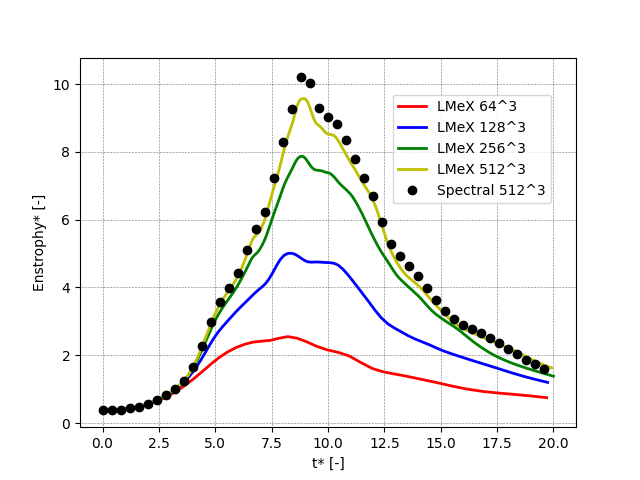
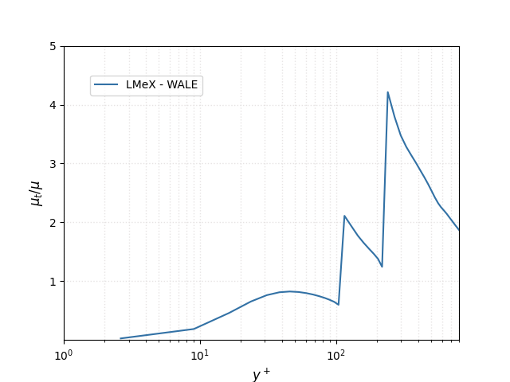

PeleLMeX Verification & Validations
===================================

This section assembles results of `PeleLMeX` simulations on a set a test cases
for which a reference solution can be obtained from the literature or an
analytical solution exists.

Laminar premixed flame
~~~~~~~~~~~~~~~~~~~~~~

The case of a laminar premixed flame is a foundational test case for a reactive
flow solver. A laminar premixed flame setup is available in ``Exec/RegTests/FlameSheet``.
The case reported hereafter is that of a planar laminar methane/air flame at
atmospheric conditions and a lean equivalence ratio of 0.9. The initial condition
is obtained from a Cantera simulation using
the DRM19 mechanism and the simulation is conducted starting with a coarse resolution
:math:`d_{l,0}/\delta_x = 3.5` (3.5 grid cells in the flame thermal thickness) and progressively
refined to :math:`d_{l,0}/\delta_x = 110` using AMR. Note that the simulation is carried for
about 30 :math:`\tau_f = d_{l,0} / S_{l,0}` before adding refinement levels ensuring that initial
numerical noise introduced by interpolating the Cantera solution onto the cartesian grid is
completely removed.

The `PeleLMeX` results obtained with the finest grid are compared to that of Cantera in :numref:`PMFLMeXCantera`.
Profiles of major and intermediate species as well as temperature across the flame front are
displayed, with Cantera results shown as black ticked lined underlying each continuous line obtained
with `PeleLMeX`, demonstrating the solver accuracy.

   : One-dimentional flame profiles with PeleLMeX and Cantera (underlying black dashed lines)

It is interesting to see how resolution affect the prediction of `PeleLMeX`. The :numref:`PMFTableResolution`
shows the laminar flame speed, obtained by numerically integrating the fuel consumption rate, at
increasing level of refinement. For each AMR level addition, simulation are conducted for about 10 :math:`\tau_f`,
until the flame speed stabilizes. With only a handful of cells across the flame thermal thickness, the flame
speed is recovered with an accuracy close to 1.5%.

.. list-table:: Effect of resolution on the laminar flame speed
    :name: PMFTableResolution
    :align: center
    :widths: 50 25 25 25 25 25 25
    :header-rows: 1

    * - :math:`d_{l,0}/\delta_x` [-]
      - 3.44
      - 6.88
      - 13.8
      - 27.5
      - 55
      - 110
    * - :math:`S_{l,0}` [m/s]
      - 0.35696
      - 0.35144
      - 0.35408
      - 0.35473
      - 0.35488
      - 0.35494
    * - Error (vs. Cantera) [%]
      - 0.02
      - 1.54
      - 0.8
      - 0.6
      - 0.58
      - 0.57

Additionally, :numref:`PMFLMeXCrseFine` compares profiles of major and intermediate species as well as
temperature across the flame front for the coarsest and the finest resolution employed. Results
indicates that major species (or temperature) are well captured whereas short lived species peak
values are locally off due to the lack of resolution but are still reasonably well located within
the flame front.

.. figure:: images/validations/PremixedFlame/LMeX_FinevsCoarse.png
   :name: PMFLMeXCrseFine
   :align: center
   :figwidth: 50%

   : Comparison of a coarsed and finely resolved 1D flame in PeleLMeX

Laminar Poiseuille flow
~~~~~~~~~~~~~~~~~~~~~~~

The laminar pipe flow or Poiseuille flow, is a basic test case for wall bounded flows.
In the present configuration, the geometry consist of a circular channel of radius :math:`R` = 1 cm
aligned with the :math:`x`-direction, where no-slip boundary conditions are imposed on
EB surface. The flow is periodic in the :math:`x`-direction and a background pressure
gradient :math:`dp /dx` is used to drive the flow.

The exact solution at steady state is:

.. math::
   u(r) = \frac{G}{4 \mu} (R^2 - r^2)

where :math:`G = -dp/dx`, and :math:`\mu` is the dynamic viscosity.
The test case can be found in ``Exec/RegTests/EB_PipeFlow``, where
the input parameters are very similar to the PeleC counterpart of
this case.

The steady-state :math:`x`-velocity profiles across the pipe diameter
at increasing resolution are plotted along with the theorerical profile in :numref:`PoiseuilleVelProf`:

.. figure:: images/validations/Poiseuille3D/PoiseuilleVelProf.png
   :name: PoiseuilleVelProf
   :align: center
   :figwidth: 50%

   : Axial velocity profile at increasing resolution with PeleLMeX

A more quantitative evaluation of PeleLMeX results is obtained by calculating
the L2 norm of the error against the analytical profile:

   : L2-norm of the axial velocity profile as function of the number of cells across the pipe diameter

showing second-order convergence for this diffusion dominated flow.

Taylor-Green vortex breakdown
~~~~~~~~~~~~~~~~~~~~~~~~~~~~~

The Taylor-Green vortex breakdown case is a classical CFD test case
described in `here <https://www1.grc.nasa.gov/research-and-engineering/hiocfd/>`_
(case C3.3). It is intended to test the capability of the code to capture turbulence accurately,
with the flow transitioning to turbulence, with the creation of small scales, followed
by a decay phase similar to decaying homogeneous turbulence.

Building and running
####################

The test case can be found in ``Exec/RegTests/TaylorGreen``.

.. code-block:: bash

   $ make -j 16 DIM=3 USE_MPI=TRUE TPL
   $ make -j 16 DIM=3 USE_MPI=TRUE
   $ mpiexec -n 16 $EXECUTABLE inputs_3d amr.ncell=64 64 64

The user can run a convergence study by varying ``amr.ncell``.

Results
#######

The following figures shows the kinetic energy, the dissipation rate and
the enstrophy as function of time (all quantities are non-dimensional)
for increasing resolutions (ranging from 64^3 to 512^3) and compared
to the results of a high-order spectral solver with a 512^3 resolution.
`PeleLMeX` results are obtained with the *Godunov_PPM* scheme and show
that even though `PeleLMeX` uses a 2nd-order scheme, reasonable
accuracy compared to the spectral results is obtained when the resolution is sufficient.

.. |TGKinEnergy| image:: images/validations/TaylorGreen/KinEnergy.png
   :width: 48%

.. |TGDiss| image:: images/validations/TaylorGreen/Dissipation.png
   :width: 48%

|TGKinEnergy| |TGDiss|

|TGEnstrophy|

Additionally, it is interesting to compare the different advection schemes
available in `PeleLMeX` (namely, *Godunov_PLM*, *Godunov_PPM*, *Godunov_BDS*,
*Godunov_PPM_WENOZ*) at a fixed 256^3 spatial resolution:

.. figure:: images/validations/TaylorGreen/Enstrophy_AllSchemes.png
   :align: center
   :figwidth: 48%

On this particular case, the differences between the advection schemes are fairly
marginal compared to those observed at different grid resolutions.

Channel Flow using EB
~~~~~~~~~~~~~~~~~~~~~

We present results of the classical periodic channel flow, available in the
``Exec/RegTests/EB_PipeFlow`` folder. Simulations are performed at three
stress Reynold number :math:`Re_{\tau}` = 180, 395 and 934 corresponding
to the cases described in `Kim et al., 1986 <https://doi.org/10.1017/S0022112087000892>`_,
`Moser et al., 1999 <https://doi.org/10.1063/1.869966>`_ and
`Hoyas and Jimenez, 2006 <https://doi.org/10.1063/1.2162185>`_, respectively. A first
DNS is performed at :math:`Re_{\tau}` = 180, then the LES models implementation is tested
at higher Reynold numbers.

For all cases, the configuration is periodic in the :math:`x` and :math:`z` directions and wall boundaries are
imposed in the :math:`y` direction using Embedded Boundaries.

DNS results at :math:`Re_{\tau}` = 180
######################################

The channel half width :math:`\delta` is set to 0.005 m, and the computational domain extend
in +/- 0.0052 m in :math:`y` with EB intersecting the domain at +/- :math:`\delta`. A background pressure gradient in
imposed in the :math:`x` to compensate wall friction. The base grid and two levels of refinement are described in :numref:`EBCDomain`:

.. list-table:: DNS Channel flow domain
    :name: EBCDomain
    :align: center
    :widths: 50 25 25 25
    :header-rows: 1

    * -
      - :math:`x`
      - :math:`y`
      - :math:`z`
    * - Domain size
      - 6.24 :math:`\delta`
      - 2.08 :math:`\delta`
      - 3.12 :math:`\delta`
    * - Base grid L0
      - 384
      - 128
      - 192
    * - L1
      - 768
      - 256
      - 384
    * - L2
      - 1536
      - 512
      - 768

The fluid in the simulation is air at ambient pressure and a temperature of 750.0 K, the physical
property of which are summarized in :numref:`EBCFluidProp`:

.. list-table:: Fluid properties
    :name: EBCFluidProp
    :align: center
    :widths: 25 25 25 25 25 25
    :header-rows: 1

    * -
      - Pressure
      - Temperature
      - Density
      - :math:`\mu`
      - :math:`\nu`
    * - Value [MKS]
      - 102325.0
      - 750.0
      - 0.468793
      - 3.57816e-5
      - 7.63271e-5

The characteristics of the flows are reported in :numref:`EBCFlowChar`:

.. list-table:: DNS Channel flow characteristics
    :name: EBCFlowChar
    :align: center
    :widths: 25 25 25 25 35
    :header-rows: 1

    * - :math:`Re_{\tau}`
      - :math:`u_{\tau}`
      - :math:`\tau_w`
      - :math:`dp/dx`
      - :math:`t^* = \delta/u_{\tau}`
    * - 180.2
      - 2.75122
      - 3.5485
      - -709.79
      - 1.817e-3

Two levels of refinement, targeted on the EB, are employed in order to sufficiently resolve the boundary
layer. The mesh characteristics are summarized in :numref:`EBCMeshes`. The :math:`y^+` value is that of
the cell center of the first full cell (uncut by the EB).

.. list-table:: Mesh characteristics
    :name: EBCMeshes
    :align: center
    :widths: 25 25 25 25 35
    :header-rows: 1

    * - :math:`Re_{\tau}`
      - :math:`\Delta y^+ L0`
      - :math:`\Delta y^+ Lmax`
      - :math:`y^+`
      - Cells count
    * - 180.2
      - 2.93
      - 0.732
      - 0.479
      - 56.6 M

Simulations are carried out for 20 eddy turn over time :math:`t^*` to reach statistically steady
conditions and data are then spatially averaged in the periodic directions and averaged in time over 10 :math:`t^*`
to get the velocity statistics in the direction normal to the wall.

|DNS180Uplus| |DNS180Urms|

Results indicate that `PeleLMeX` is able to reproduce accurately the DNS data obtained with
a high-order spectral solver, provided sufficient resolution at the wall.

LES results at :math:`Re_{\tau}` = 395, 934
###########################################

The channel half width :math:`\delta` is set to 0.01 m, and the computational domain extend
in +/- 0.0101 m in :math:`y` with EB intersecting the domain at +/- :math:`\delta`. The base grid is coarser
than the DNS one by a factor of 2. A background pressure gradient in imposed in the :math:`x` to compensate
wall friction. The fluid conditions are similar to that of the DNS case and the flow
and mesh characteristics are summarized in :numref:`EBCLESFlowsChar`:

.. list-table:: LES Channel flow characteristics
    :name: EBCLESFlowsChar
    :align: center
    :widths: 25 25 25 25 25 25 25
    :header-rows: 1

    * - :math:`Re_{\tau}`
      - :math:`u_{\tau}`
      - :math:`\tau_w`
      - :math:`dp/dx`
      - :math:`t^* = \delta/u_{\tau}`
      - :math:`\Delta y^+ L0`
      - :math:`\Delta y^+ Lmax`
    * - 395
      - 3.01492
      - 4.26121
      - -426.121
      - 3.3317e-3
      - 12.467
      - 6.2336
    * - 934
      - 7.12895
      - 23.8250
      - -2382.50
      - 1.4027e-3
      - 29.479
      - 7.36984

Note that a single level of refinement is employed for the :math:`Re_{\tau}` = 395 while two are
used for :math:`Re_{\tau}` = 934 in order to provide sufficient (but still below :math:`y^+=1`)
resolution near the walls.

Simulations are performed with the WALE LES SGS model. The plots below shows that `PeleLMeX` is
able to reproduce the normalized velocity profile reasonably well even though the resolution
requirements for a Wall Resolved LES are not quite attained with the grid employed here.

.. |LES395Urms| image:: images/validations/EBChannelFlow/VelRMSplus_Re395_LES_LMeX.png
   :width: 48%

|LES395Uplus| |LES395Urms|

.. |LES934Urms| image:: images/validations/EBChannelFlow/VelRMSplus_Re934_LES_LMeX.png
   :width: 48%

|LES934Uplus| |LES934Urms|

The velocity variance in the plot above show distinctive drops around coarse/fine interfaces,
where the filter size change and a the subgrid-scale contribution increases as depicted on the figure below showing the
subgrid-scale viscosity for the :math:`Re_{\tau}` = 934 case.

Further work is ongoing to assess how to better handle large LES filter size changes in the context
of AMR-LES
